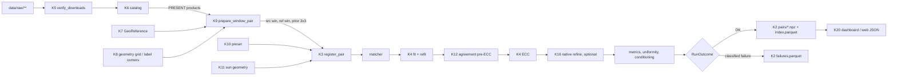
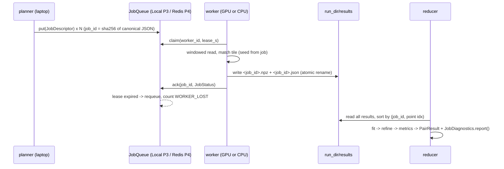

# HLD — Chandralipi target architecture

Scope: the state after Phases 0 → 1 → 2 → 1B → 3 → 4 (`docs/plan/PHASES.md`). Decisions: `docs/plan/DECISIONS.md`. Frozen interfaces: `docs/plan/CONTRACTS.md` (IDs `C<nn>`). Defects driving the work: `docs/plan/AUDIT.md`.

## 1. Components

| # | component | path | phase | role |
|---|---|---|---|---|
| K1 | provenance | `src/lunar_reg/provenance.py` | 0 | `ValueSource` enum carried by every new number (C01) |
| K2 | results store v2 | `src/lunar_reg/results.py`, `src/lunar_reg/runrecord.py` | 0 | `PairResult`, `index.parquet`, `pairs/*.npz`, `failures.parquet` (C04, C05); `run_record.json` writer (C15) |
| K3 | core pipeline | `src/lunar_reg/pipeline.py` | 0/1/2 | `register_pair` → classified `RunOutcome` (C02, C03) |
| K4 | fit + refine | `src/lunar_reg/align/{estimate,refine}.py` | 0 | seeded robust fit, refit at `refit_threshold_px`, ECC in the model's own motion type (C06, C07) |
| K5 | downloads | `scripts/verify_downloads.py`, `src/lunar_reg/ingest/downloads.py` | 1 | `data/raw/DOWNLOADS.json` manifest + verifier (C08) |
| K6 | catalog | `src/lunar_reg/ingest/catalog.py` | 1 | what is on disk per instrument; ABSENT is an outcome, not an error (C09) |
| K7 | map georeference | `src/lunar_reg/ingest/lro.py` | 1 | `GeoReference` from PDS4 cartography, never from GDAL's transform (C10) |
| K8 | pixel geometry | `ingest/overlap.py` + `ingest/geometry_grid.py` | 1 | per-pixel lon/lat grid when present, label-corner fallback, tagged by `PriorSource` |
| K9 | pair preparation | `src/lunar_reg/pairs.py` | 1 | `prepare_window_pair` → source window, reference window, 3×3 prior (C11) |
| K10 | preprocessing presets | `src/lunar_reg/preprocess/presets.py` | 1 | named presets applied inside `register_pair` (C12) |
| K11 | sun geometry | `src/lunar_reg/ingest/sun.py`, `scripts/fit_reference_sun.py` | 1 | Sun azimuth/elevation for both images from SPICE generic kernels (COMPUTED), cross-checked against ODE incidence (DOCUMENTED) and a DTM-hillshade fit (INFERRED); ISRO label azimuth convention derived from SPICE (C13, G14) |
| K12 | cross-matcher agreement | `src/lunar_reg/eval/agreement.py` | 1 | pre-ECC corner disagreement between matchers (C14) |
| K13 | site runner | `scripts/run_vikram.py` → `src/lunar_reg/sites/runner.py` | 1 | catalog → pairs → register → store, failures persisted |
| K14 | device profiles | `src/lunar_reg/device.py`, `configs/device_profiles/*.json` | 2 | measured VRAM model per GPU (C16, C17) |
| K15 | tiled matching | `src/lunar_reg/match/{tiled,stitch}.py` | 2 | prior-driven tile pairing, per-tile classified outcomes (C18) |
| K16 | native refinement | `src/lunar_reg/align/native.py` | 2 | tiled refinement at reference native GSD seeded by coarse transform (C19) |
| K17 | illumination bridge | `src/lunar_reg/eval/render.py`, `src/lunar_reg/consensus.py` | 1B | DTM shaded-relief reference + pooled consensus (C21) |
| K18 | distributed | `src/lunar_reg/distributed/{job,outcome,planner,queue,worker,reducer}.py` | 3 | job descriptor, local queue, workers, reducer (C22–C26) |
| K19 | multi-host | `distributed/{redis_queue,cache,scheduler}.py` | 4 | Redis Streams transport, node cache, capacity routing (C27) |
| K20 | viewers | `dashboard/app.py`, `scripts/export_web_data.py`, `web/` | 1 | read-only consumers of K2 |

## 2. Data flow — one pair (Phases 0–2, 1B)

## 3. Data flow — distributed (Phases 3–4)

Phase 4 changes only the `JobQueue` implementation and adds node caches plus capacity routing; `JobDescriptor`, `JobResult`, worker loop and reducer are unchanged (C22–C26 frozen in Phase 3).

## 4. Cross-cutting concerns

### 4.1 Errors — classified outcomes
| layer | enum | where | rule |
|---|---|---|---|
| pair | `RunStatus` (C02) | pipeline | library never raises for a bad pair; returns `RunOutcome` |
| instrument | `InstrumentStatus` (C09) | catalog | missing instrument = `ABSENT`, counted, printed |
| download | `DownloadStatus` (C08) | verifier | size/sha mismatch = `CORRUPT`, never deleted automatically |
| tile | `TileStatus` (C18) | tiled | per-tile outcome; OOM is a status, not a log line |
| job | `JobStatus` (C23) | distributed | OK / NO_MATCHES / DEGENERATE_OVERLAP / READ_FAILED / OOM / WORKER_LOST / TIMEOUT |

Every enum has an `is_failure` property and a diagnostics object with `record(outcome)`, per-status counts, first sample per status, and `report() -> str`. The library logs one summary line; the caller prints `report()` on every run. Exceptions are for programmer error only (wrong types, calling a result accessor on a failed outcome).

### 4.2 Provenance
New numbers carry `ValueSource` (C01): `MEASURED` (a run on this project's data or hardware), `COMPUTED` (derived deterministically from measured inputs), `DOCUMENTED` (a cited external document), `INFERRED` (fit or reasoning, not documented), `UNKNOWN`. Existing enums (`Provenance`, `ParamSource`, `TermSource`) stay. Docs quote numbers only from a run artefact whose path sits next to the number; otherwise `[INSERT RESULT]`.

### 4.3 Logging and run records
- `logging.getLogger(__name__)` per module; no `print` inside `src/` except CLI entry points.
- Every RUN prompt writes `<out_dir>/run_record.json` (C15): command, git sha, dirty flag, host, device, torch/cv2 versions, UTC start/end, outcome counts, artefact paths.

### 4.4 Configuration
- Per-run knobs: `PipelineConfig` dataclass (C03). No YAML config loader (`configs/default.yaml` deleted in P0).
- Machine facts: `configs/device_profiles/<slug>.json` (C16, measured), `configs/hosts.json` (Phase 4, human-filled).
- Data locations: `data/raw/**` (inputs, gitignored), `data/processed/**` (outputs, gitignored), `DOWNLOADS.json` (C08).

### 4.5 Determinism
`estimate_transform(seed=)` sets `cv2.setRNGSeed(seed)` before each fit (C06). Bootstrap uses its own seeded generator. Distributed seed = first 8 hex digits of `job_id` as int (C22). The reducer sorts points by `(job_id, index)` before fitting.

### 4.6 Security and data handling
- PRADAN (ISRO) products are downloaded by a human only; no stored credentials; no automation of the logged-in site (CLARIFY R6).
- `np.load(..., allow_pickle=False)` everywhere; JSON for metadata; no `pickle`.
- Scripts use `subprocess.run([...])` with argument lists, never `shell=True` with interpolated input.
- Redis (Phase 4) is bound to the LAN interface with `requirepass` from `.env` (`REDIS_URL`); `.env` is gitignored.
- Licences: SuperGlue noncommercial → opt-in flag and `x_licence` field shown by both viewers (C04).

### 4.7 Integrity of harness and benchmarks
No tool-level deny rules (CLARIFY Q22/R8). Each phase ships `harness/MANIFEST.sha256` covering `harness/**` and `benchmark/**` (except `benchmark/score.json`, `benchmark/out/**`). Every `check_*.sh` and `verify.sh` runs `sha256sum -c` first, and `verify.sh` also fails if `git diff <base>..HEAD -- Phase_<i>/harness Phase_<i>/benchmark` is non-empty.

### 4.8 Hardware envelope
| host | GPU | VRAM | used by |
|---|---|---|---|
| laptop (primary) | RTX 4060 Laptop | 8188 MiB, ~754 MiB used by desktop | all phases |
| second host | RTX 3060 | 6 GB | Phase 4 only; OS/LAN unconfirmed (CLARIFY R3b) |

GPU-only tests carry `@pytest.mark.gpu`, skip with a reason when CUDA is absent, and `score.json` counts skips separately from passes.
