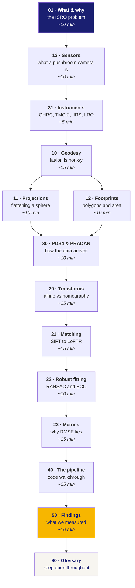

# Roadmap — how to understand this project

You know software engineering. You do not know geodesy, remote sensing, or
planetary data formats. These notes assume exactly that.

Nothing here is required by the pipeline. It is gitignored and written for one
reader. Read in the order below; each doc assumes only the ones before it.

## If you only have an hour

**01 → 13 → 20 → 23 → 50.** The problem, the hardware, the maths that turned out
to matter most, why our metrics are unusual, and what we actually learned.

## If you are presenting this to a panel

**01 → 23 → 50.** Everything a judge is likely to probe: what was asked, why the
obvious metric is insufficient, and what we measured that others did not.

## The four ideas that carry the whole project

If you retain nothing else:

| # | Idea | Doc |
|---|---|---|
| 1 | Latitude/longitude are **angles**, not distances. Longitude lines converge; near a pole everything Cartesian breaks | 10 |
| 2 | A **pushbroom** sensor has no single viewpoint, so no single perspective transform describes it | 13, 20 |
| 3 | **Illumination inverts features.** Move the sun and the lit crater wall becomes the dark one — descriptors key on exactly what changed | 01, 21 |
| 4 | RMSE measured on the points you fitted to is **not accuracy**. It barely notices *where* those points are | 23 |

## Conventions in these notes

- **Measured** means a number this project produced from a run. It names the module.
- **Documented** means it comes from a paper or standard we read.
- **Unverified** means nobody has checked it. Said explicitly, never smoothed over.
