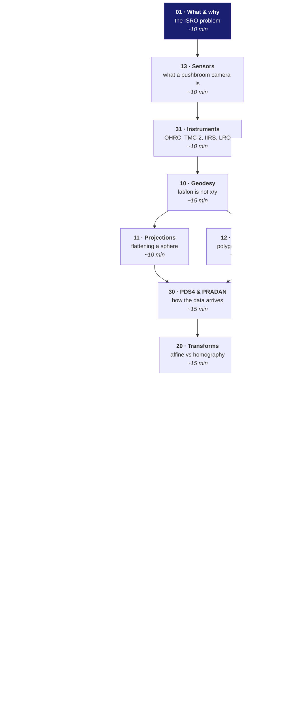

# Roadmap — how to understand this project

You know software engineering. You do not know geodesy, remote sensing, or
planetary data formats. These notes assume exactly that, and **every term is
defined in plain English at the point it is first used** — if a sentence here
needs background you do not have, that is a bug in the doc, not in you.

Nothing here is required by the pipeline. It is gitignored and written for one
reader. Read in the order below; each doc assumes only the ones before it.

## The reading tracks

**If you only have an hour.** 01 → 13 → 20 → 23 → 50. The problem, the hardware,
the maths that turned out to matter most, why our metrics are unusual, and what
we actually learned.

**If you are presenting to a panel.** 01 → 23 → 50, then skim 61. Everything a
judge is likely to probe: what was asked, why the obvious metric is
insufficient, what we measured that others did not, and a straight answer to
"where is the AI in this".

**If you are about to write code.** 40 → 60 → the module you are touching.

**If someone asks how this scales.** 70. It is explicitly a design, not a
description — nothing in it has been built, and it says so on line one.

## The full index

| # | doc | what it is |
|---|---|---|
| 00 | this file | the map |
| 01 | What & why | the ISRO problem statement, decoded |
| 10 | Geodesy | latitude and longitude are angles, not distances |
| 11 | Projections | flattening a sphere, and what it costs |
| 12 | Footprints | where an image actually is, as a polygon |
| 13 | Sensors | how a pushbroom camera takes a picture |
| 20 | Transforms | affine, homography, and the 639 m error |
| 21 | Matching | SIFT through LoFTR, classical and neural |
| 22 | Robust fitting | RANSAC, ECC, and fitting through bad data |
| 23 | Metrics | why RMSE lies, and the metrics we propose |
| 30 | PDS4 & PRADAN | how the data arrives, and how not to misread it |
| 31 | Instruments | OHRC, TMC-2, IIRS, and the LRO reference |
| 40 | The pipeline | a walk through the code |
| 50 | Findings | every number we measured, and every gap |
| 60 | The maths | every formula this project uses, derived from scratch |
| 61 | ML & AI | what learning is used, and what would genuinely help |
| 70 | Distributed GPU | system design for scaling out. **A design, not built.** |
| 90 | Glossary | every term, with the doc that introduces it |

## The four ideas that carry the whole project

If you retain nothing else:

| # | idea | doc |
|---|---|---|
| 1 | Latitude and longitude are **angles**, not distances. Longitude lines converge; near a pole everything Cartesian breaks. Our data is at −85°. | 10 |
| 2 | A **pushbroom** sensor has no single viewpoint, so no single perspective transform describes it. Assuming one costs **639 m**. | 13, 20 |
| 3 | **Illumination inverts features.** Move the sun and the lit crater wall becomes the dark one — descriptors key on exactly what changed. SIFT: 228 matches → 0. | 01, 21 |
| 4 | RMSE measured on the points you fitted to is **not accuracy**. It barely notices *where* those points are — we measured a **51×** gap. | 23 |

## Conventions in these notes

- **Measured** means a number this project produced from a run. It names the module.
- **Documented** means it comes from a paper or standard we read.
- **Unverified** means nobody has checked it. Said explicitly, never smoothed over.
- Where a run has not happened, the cell says so. There are no plausible-looking
  placeholder numbers anywhere in these docs.
