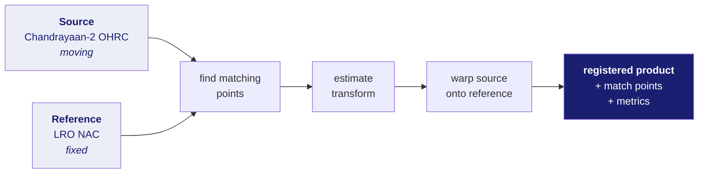
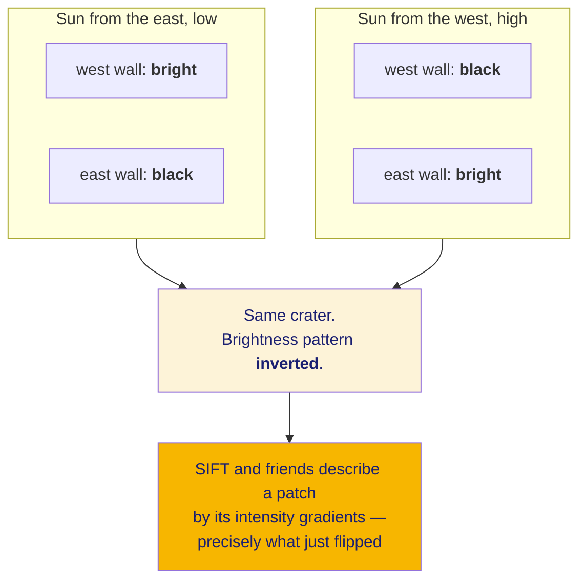

# 01 · What this project does, and why

## What ISRO actually asked for

**New words in this doc:**

| word | plain meaning |
|---|---|
| **registration** | finding the geometric transform that lays one image exactly on top of another picture of the same place. The whole problem. |
| **source / reference** | the image you move, and the image you align it to. Also called *moving* and *fixed*. |
| **sub-pixel** | accurate to less than the width of one pixel. |
| **RMSE** | Root Mean Square Error — average miss distance, with big misses weighted more. |
| **inlier** | a matched point pair that agrees with the fitted transform. A good match. |
| **descriptor** | a short vector summarising what a small patch of image looks like, so it can be compared against patches in another image. |
| **azimuth** | a compass direction in degrees. "Sun azimuth" is which way the sun is, horizontally. |
| **terminator** | the boundary between the lit and unlit parts of a body. Abrupt on the Moon, because there is no atmosphere to scatter light. |
| **GSD** | Ground Sample Distance — how much ground one pixel covers. |
| **synthetic scene** | a computer-generated test image where we chose the correct answer in advance, so accuracy can actually be checked. |

---

Problem statement **SIH26166**, Indian Space Research Organisation, Smart India
Hackathon 2026. The core sentence:

> Generic software solution for finding correspondence between Chandrayaan-2
> acquired optical images and Lunar reference images with a **sub-pixel
> accuracy** of source image **maintaining uniform distribution** across the
> images.

Deliverables they name:
- Software, and a registered product with its corresponding match points
- Evaluation metrics — they suggest RMSE, inlier match count, inlier ratio

## What "image registration" means

Two pictures of the same place, taken at different times, from different angles,
possibly by different cameras. Find the geometric transform that lays one on top
of the other.

Vocabulary from the problem statement, which we use throughout:

- **Reference image (fixed)** — the one you align *to*. For us, usually LRO.
- **Source image (moving)** — the one you transform. For us, Chandrayaan-2.

## Why anyone wants this

Registration is the step that makes everything else possible:

- **Change detection.** Did a new crater appear? Only answerable if two epochs
  are aligned to sub-pixel precision — otherwise misalignment looks like change.
- **Fusing instruments.** IIRS tells you mineral composition at 80 m. OHRC shows
  you morphology at 0.25 m. Combining them requires knowing which OHRC pixels
  sit inside which IIRS pixel.
- **Landing site selection and navigation.** Terrain-relative navigation matches
  a live camera frame against a stored map. That is registration under a time
  limit.
- **Cartography.** Mosaicking many strips into one map requires every strip
  aligned to its neighbours.

## Why it is genuinely hard here

The problem statement names three challenges. All three are real, and we
measured the first.

### 1. Illumination variation

The Moon has no atmosphere. No atmosphere means no scattered light, which means
shadows are **hard-edged and black**, not soft and grey as on Earth.

Now move the sun. A crater rim is a closed circular ridge, so at any sun angle
exactly half of it is lit and half is shadowed — and **which half swaps** when
the sun moves round.

**Measured** (`eval/error_budget.py` on synthetic scenes with a known answer):

| sun azimuth difference | SIFT geometrically-correct matches |
|---|---|
| 15° | 228 |
| 30° | 4 |
| 60° | **0** |

Not gradual degradation. A cliff.

The technical name for this is **nonlinear radiation distortion** — the
relationship between the two images' brightness values is not a straight line
you can correct with contrast adjustment. It genuinely inverts in places.

### 2. Scale variation

| pair | ground-sample ratio |
|---|---|
| OHRC ↔ LRO NAC | 2× |
| TMC-2 ↔ OHRC | 20× |
| IIRS ↔ TMC-2 | 16× |
| **IIRS ↔ OHRC** | **320×** |

No feature matcher bridges 320×. SIFT is scale-invariant across maybe a few
octaves, not eight. So the pipeline must *choose a reference at a comparable
scale* rather than hope a detector copes — see doc 31.

### 3. Viewpoint variation

Different orbits, different look angles, a curved body, and a sensor that builds
its image one line at a time while moving. Doc 13 explains why that last point
matters more than it sounds.

## What we deliver beyond the ask

The problem statement asks for RMSE, inlier count, inlier ratio. We provide
those and two more, because **measurement showed those three cannot substantiate
the statement's own "sub-pixel across the image" requirement**. See doc 23 — this
is the most defensible novelty in the project.

## The honest status

Every headline number in this repo came from **synthetic** lunar scenes until
very recently, because Chandrayaan-2 archive access had not cleared. Five real
products have now been processed. The synthetic scenes exist for a reason worth
understanding: they carry a **known ground-truth transform**, which real data
never does, and that is the only way to measure whether an accuracy metric is
telling the truth.
