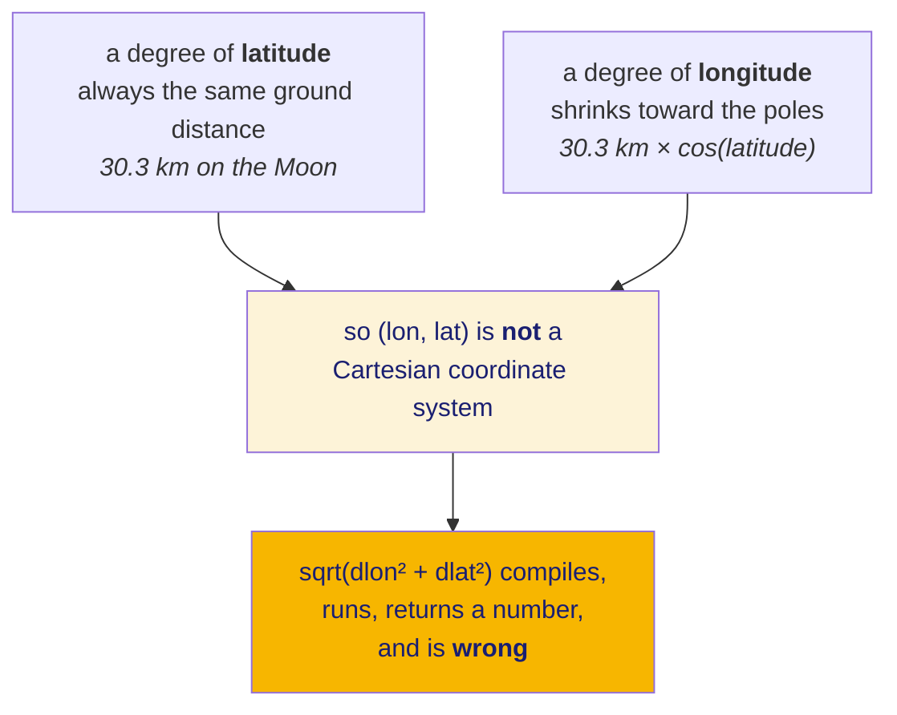
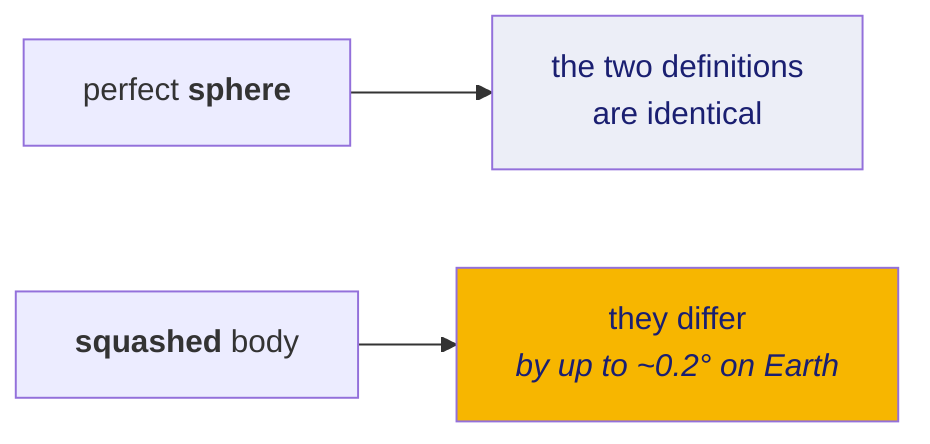

# 10 · Latitude and longitude are not x and y

If you take one thing from these notes, take this doc. Almost every bug this
project found on real data traces back to treating an angle as a distance.

**New words in this doc:**

| word | plain meaning |
|---|---|
| **geodesy** | the science of measuring positions and shapes on a planet. The field this doc is an hour-long tour of. |
| **datum** | the agreed model of the body's shape and where its centre and axes are. Two datums can give the same place different coordinates. |
| **ellipsoid** | a squashed sphere. Earth is one; the Moon is close enough to a plain sphere that we use a sphere. |
| **planetocentric** | latitude measured as the angle from the centre of the body. |
| **planetographic** | latitude measured from the local surface normal. On a sphere the two are identical; on a squashed body they differ. |
| **selenographic** | "geographic, but for the Moon". *Seleno-* is the Greek prefix for Moon. |
| **colatitude** | 90° minus latitude — the angle away from the pole rather than away from the equator. |
| **great circle** | the shortest path between two points on a sphere. |

---

## The core idea

A latitude of −85° does **not** mean "85 units south of the equator". It means
"rotate 85 degrees down from the equator". Longitude 142° means "rotate 142
degrees around the axis".

They are *angles*. The distance an angle corresponds to depends on where you
already are.



Why longitude shrinks: lines of longitude all meet at the poles. At the equator
they are as far apart as they get; at the pole the distance between them is
zero. The shrink factor is exactly `cos(latitude)`.

## The number that made this real for us

Our OHRC products sit at latitude **−85°**. `cos(85°) = 0.0872`.

| latitude | one degree of longitude, on the ground |
|---|---|
| 0° | 30.3 km |
| 45° | 21.4 km |
| 60° | 15.2 km |
| **−85° — our data** | **2.6 km** |
| 89° | 0.53 km |

At our data's latitude a degree of longitude is **eleven and a half times
shorter** than a degree of latitude. Code that treats the two as the same unit
is not slightly off; it is off by an order of magnitude, and only in the
east–west direction, which produces results that look *plausibly* wrong rather
than obviously wrong. Those are the expensive ones.

## The distance formula that works

Convert both points to angles in **radians** (every maths library wants radians;
every data file gives degrees — this conversion is the single most common bug in
the field), then:

```
a = sin²((lat₂ − lat₁)/2) + cos(lat₁)·cos(lat₂)·sin²((lon₂ − lon₁)/2)
d = 2 · R · arcsin(√a)
```

This is the **haversine** formula. `R` is the body's radius; for the Moon this
project uses:

```python
LUNAR_RADIUS_M = 1_737_400        # constants.py
```

You will also see a shorter formula using `arccos`. It is algebraically
equivalent and numerically worse: for two points close together, `arccos` of
something very near 1.0 loses most of its significant digits. Haversine does
not. Use haversine.

## The pole problem, and why it is not a rare edge case for us

Near a pole, longitude stops carrying useful information. At 89.9° latitude the
entire 360° range of longitude spans a circle only about 19 km around. Small
position errors produce enormous longitude swings. Anything that averages,
interpolates, or takes a bounding box in longitude produces nonsense there.

**This is not hypothetical for this project.** All three of our real OHRC
products are at **−85°**, which is 5° from the south pole. Polar handling is not
an edge case we should support; it is our main case.

`ingest/overlap.py` handles it by not working in longitude at all near the pole.
It projects onto a flat plane centred on the pole first (doc 11), does the
geometry there, and projects back. The switch happens at 80° latitude, and:

**Measured:** the switch produces a **0.3–0.8% discontinuity** in computed area.
Two different methods will not agree exactly at their boundary. That number is
the honest size of the seam, recorded rather than hidden.

There is also a hard refusal, not an approximation:

```python
POLAR_CLIP_MAX_COLATITUDE_DEG = 60.0
```

**Colatitude** is 90° minus latitude — how far you are from the pole rather than
from the equator. This says the polar flat-plane method is trusted only within
60° of the pole it is centred on. A pair with one product near the pole and one
near the equator falls outside every method's valid range, so the code returns a
classified refusal (`POLAR_EXTENT_UNSUPPORTED`) instead of a number it does not
believe.

## Datum: the question we cannot yet answer

A **datum** is the agreed answer to "what shape is this body, where is its
centre, and where do its axes point". Coordinates are meaningless without one:
the same physical crater has different numbers under different datums.

Two flavours of latitude exist:

- **Planetocentric** — the angle at the centre of the body between the equatorial
  plane and the line to your point.
- **Planetographic** — the angle between the equatorial plane and the line
  perpendicular to the *surface* at your point.



The Moon is very nearly spherical, so the difference is small — but "small"
against a **sub-pixel** requirement at 0.25 m/px is not automatically negligible,
and nobody has computed it for our case.

**Unverified, and it is an open question for a human to resolve.** The ISRO
geometry label states the coordinates are *"selenographic"* and gives **no unit**
and **no coordinate-system element**. Whether the latitudes are planetocentric
or planetographic is not stated anywhere in the file. It does not matter while
we only compare Chandrayaan-2 products to each other, because any consistent
convention cancels out. It matters the moment we mix in LRO, which is the
entire plan. This is written down in `docs/project/CONTEXT_HANDOFF.md` as a decision awaiting
a human, not as a solved item.

## Rules of thumb to carry

1. Never compute a distance from raw degrees. Convert to metres, or to 3D
   Cartesian, first.
2. Never take a bounding box in longitude near a pole, or across the ±180° line.
3. Always know whether your angles are degrees or radians at every boundary.
4. Do not average longitudes. `(179° + (−179°)) / 2 = 0°`, which is on the
   opposite side of the Moon from both inputs.
5. Write down which datum you assumed, even — especially — when you had to guess.
