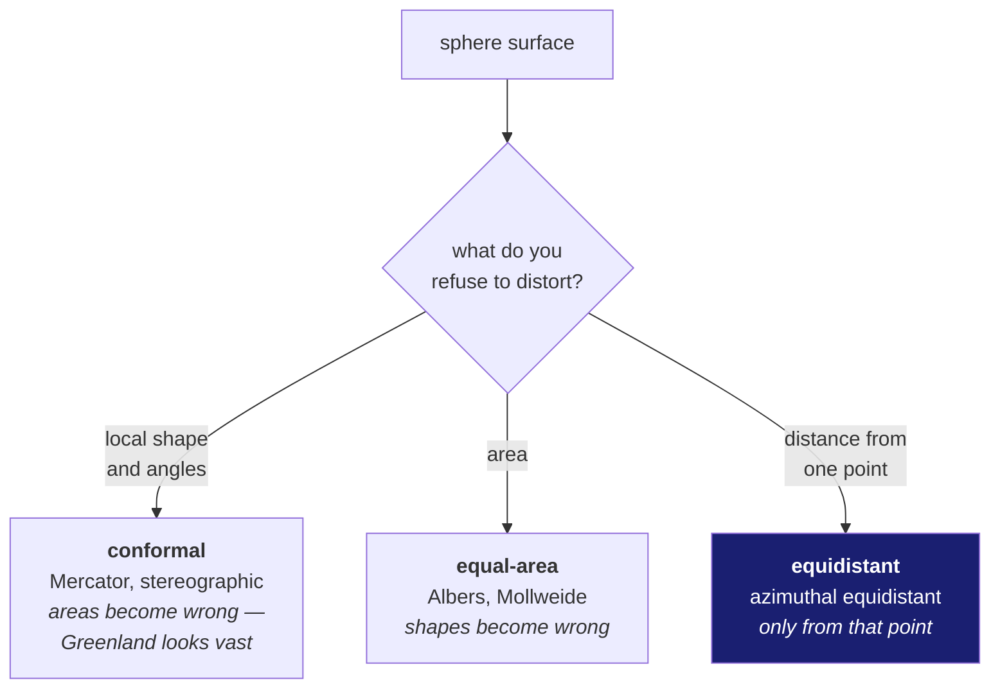

# 11 · Flattening a sphere, and what it costs

Read doc 10 first.

**New words in this doc:**

| word | plain meaning |
|---|---|
| **projection** | a rule for turning positions on a curved surface into positions on a flat plane. |
| **distortion** | what the projection got wrong. Every projection gets *something* wrong; there is no exception. |
| **conformal** | preserves angles and local shape. Distorts area. |
| **equal-area** | preserves area. Distorts shape. |
| **equidistant** | preserves distance, but only along certain lines — usually those radiating from one chosen point. |
| **azimuthal** | built around a single centre point, radiating outward. |
| **tangent point** | the one place where the flat plane touches the sphere, and therefore the only place with no distortion at all. |

---

## Why you cannot win

A sphere's surface cannot be flattened without stretching. This is a theorem,
not an engineering limitation — Gauss proved it in 1827 (*Theorema Egregium*).
Try it with an orange peel: it tears, or it wrinkles, always.

So every projection is a *choice about which error to accept*:



There is no projection that preserves shape *and* area *and* distance. Choosing
one is choosing which of your downstream calculations stays honest.

## What this project chose, and why

`ingest/overlap.py` uses an **azimuthal equidistant** projection, via
`pygeodesy.azimuthal.Equidistant`, for polar footprints.

Decoded:

- **azimuthal** — everything is measured outward from one centre point. Here the
  centre is placed at the pole the data sits near.
- **equidistant** — distances measured *from that centre* are exactly right.
  Distances between two points that both sit off to one side are not.

Why this is the right trade for us: our work near the pole is *polygon
intersection* — does footprint A overlap footprint B, and by how much? That
needs the shapes to be positioned correctly relative to a common centre, which is
exactly what this projection guarantees, and it degrades gracefully with distance
from that centre rather than blowing up at the pole the way a longitude-based
approach does.

The class in the code is `PolarFrame`, and it scales its output to **degrees of
arc** rather than raw metres, so downstream code that expects degree-ish
magnitudes keeps working.

## The honest costs, both measured

**Cost 1 — a seam.** The pipeline uses the spherical path away from the poles and
the flat-plane path near them, switching at 80° latitude. Two different methods
do not agree exactly at their boundary.

> **Measured:** a **0.3–0.8% discontinuity** in reported area across the switch.

Recorded rather than smoothed over. If a footprint's area jumps slightly when it
crosses 80°, that is why, and it is not a bug.

**Cost 2 — a refusal, not an approximation.**

```python
POLAR_CLIP_MAX_COLATITUDE_DEG = 60.0
```

The projection is trusted only within 60° of its centre point. A pair with one
polar product and one mid-latitude product cannot be handled by either method,
so `overlap.py` classifies it `POLAR_EXTENT_UNSUPPORTED` and counts it, rather
than returning a distorted number that looks like an answer.

That choice reflects a standing rule in this project: a batch stage never
silently drops the items it cannot handle. It classifies them, counts them, and
prints a sample.

## Two traps that bit us

**The ±180° wrap.** Longitude is circular; the number line is not. A footprint
straddling the anti-meridian has corners at, say, 179.9° and −179.9°, which are
0.2° apart on the Moon and 359.8° apart in arithmetic.

**Measured and fixed:** `polygon_area_m2` returned exactly **0 m²** for
longitudes outside ±180°. The underlying library raised a `RangeError`, which
was caught and logged at `debug` level — invisible at normal log settings. The
same trap existed independently in `azimuthal.Equidistant.forward`. Both were
silent: no crash, no warning, just a zero that looked like "these do not
overlap".

That is the exact failure shape this project's rules exist to prevent. A zero
from "no overlap" and a zero from "the maths threw and we swallowed it" are
indistinguishable in a results table and mean opposite things.

**Assuming a projected polygon is still convex.** *Convex* means no dents — a
line between any two points inside stays inside. Standard polygon-clipping
algorithms such as Sutherland–Hodgman **require** the clipping polygon to be
convex and produce silently wrong output otherwise. A footprint that was a clean
rectangle on the sphere need not stay convex after projection.

This project therefore uses **Foster–Hormann–Popa** clipping (`clipFHP4`), which
handles non-convex polygons correctly. The cost is that it is slower and more
complex; the benefit is that it does not quietly return the wrong area.

## The rule to carry

State your projection wherever you state a coordinate, and state what it
preserves. "Overlap area = 69.30 km²" is incomplete. "Overlap area = 69.30 km²,
computed by spherical excess on a lunar radius of 1,737,400 m" is a claim
somebody can check.
