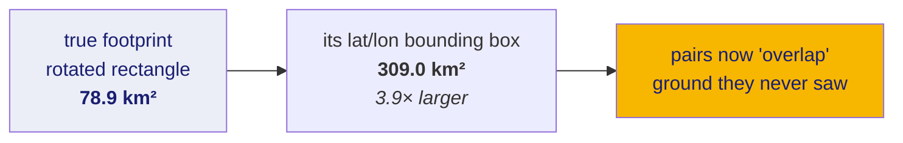
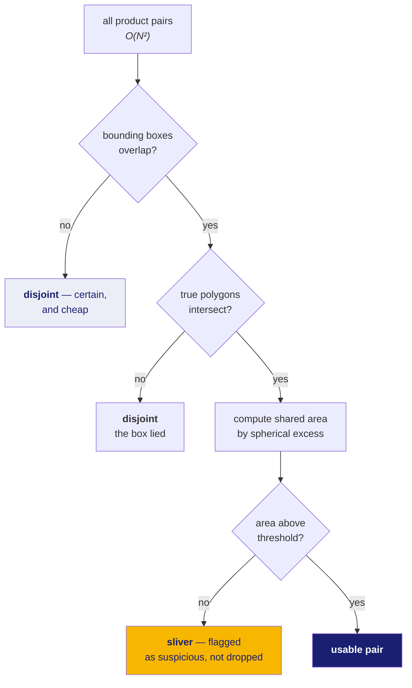

# 12 · Footprints — where an image actually is

**New words in this doc:**

| word | plain meaning |
|---|---|
| **footprint** | the patch of ground an image covers, described as a polygon on the surface. |
| **polygon** | a closed shape defined by an ordered list of corner points. **Ordered** is the load-bearing word. |
| **ring order** | going round the boundary in sequence, without crossing over. The order a polygon's corners must be in. |
| **bounding box** | the smallest north–south / east–west rectangle that contains a shape. |
| **bow-tie** | what you get when a four-sided polygon's corners are listed in the wrong order: the edges cross and the shape self-intersects. |
| **ground track** | the path the spacecraft's position traces on the surface below it. |

---

## Why a footprint is a polygon and not a box

An image covers a patch of ground. To decide whether two images can be
registered to each other you first have to decide whether they *look at the same
place at all*, which means intersecting two patches.

The obvious shortcut is to store each patch as a bounding box: minimum and
maximum latitude, minimum and maximum longitude. Four numbers, trivially fast to
intersect.

It is wrong, and this project measured how wrong.

## The bounding-box finding

A spacecraft's ground track is not aligned north–south. It crosses the surface at
whatever angle its orbit dictates. So an image footprint is a **rotated**
rectangle, and the bounding box of a rotated rectangle is much larger than the
rectangle.



**Measured, on real products, on the production code path:**

| sensor | inflation from using a bounding box |
|---|---|
| OHRC | **3.9× to 4.2×** — 78.9 km² becomes 309.0 km² |
| TMC-2 | **2.2× to 2.3×** |

OHRC is worse because its footprint is a long thin ribbon. The thinner and more
rotated a rectangle is, the more empty space its bounding box adds.

This was a live bug: `ingest/manifest.py` was reducing four real corner
coordinates to a bounding box before the overlap stage ever saw them. The fix
was to carry all four corners through the manifest:

```python
COLUMNS = (
    ...
    # The four real corners, carried through rather than reduced to a box.
    *(f"corner{i}_{c}" for i in range(1, 5) for c in ("lat", "lon")),
    "min_lat", "max_lat", "min_lon", "max_lon", ...
)
```

The bounding box is still stored — it is a genuinely useful cheap *pre-filter*,
because if two boxes do not overlap then the true footprints certainly do not.
It just must never be the final answer.

## Corner ordering, and a mistake worth recording

To build a polygon you need the corners in **ring order** — walking round the
boundary. Feed them in the wrong order and the edges cross, producing a
**bow-tie**: a self-intersecting shape whose "area" is the difference of two
lobes rather than the area of anything real.

ISRO's labels name their corners:

```
upper_left · upper_right · lower_left · lower_right
```

Numbered 1, 2, 3, 4 in that order. **That is not ring order.** Walking
1 → 2 → 3 → 4 goes upper-left, upper-right, *lower-left*, lower-right — the third
step crosses the shape diagonally.

Ring order is **1, 2, 4, 3**:

```python
ordered = (corners[0], corners[1], corners[3], corners[2])
```

**This is worth writing down because I got it wrong in the other direction.**
Earlier in this project I reported a catastrophic corner-ordering bug — a claimed
1201× area error in the production code. It was not real. `footprint_from_row`
was already traversing `1, 2, 4, 3` correctly. My throwaway test had bypassed
the pipeline and assembled the ring by hand in naive numeric order, so the bug
was in the test, and the "measurement" measured my own mistake.

The retraction is preserved in `CONTEXT_HANDOFF.md` §1.1 rather than deleted,
because a later reader needs to know the claim was made and withdrawn. A silently
deleted false alarm is worse than a documented one — someone finds the old
statement somewhere and acts on it.

The general lesson: when a test reports a spectacular number, suspect the test
before the code. 1201× was not a plausible bug; it was a plausible *test* bug.

## Real overlaps, on real data

**Measured** — the first real overlap detection this project performed on real
Chandrayaan-2 products, reproduced independently rather than taken on trust:

| pair | shared area | share of the source footprint |
|---|---|---|
| A ↔ B | **69.30 km²** | 88% |
| A ↔ C | **65.97 km²** | 84% |
| B ↔ C | **74.22 km²** | 94% |

High percentages because these are repeat passes over the same polar site.

**And the result that actually matters, stated as plainly as the good one:**

```
cross-sensor usable pairs: 0
OHRC × TMC-2: disjoint = 9
```

Every OHRC–TMC-2 pair is correctly classified as **disjoint** — not failed, not
skipped: they genuinely do not overlap. Our OHRC products are near the south
pole at −85°; our TMC-2 products are at 142° east near the equator. They are
pictures of different parts of the Moon.

This is the project's real blocker, and it is a **data selection** problem, not a
code problem. It needs a human to choose a target region and re-download against
it. No amount of algorithm work fixes two images of different places.

## Two counting quirks to be aware of

A same-sensor overlap scan currently compares each product **with itself** and
counts each pair **twice**. Three products therefore report nine "pairs" rather
than three. The self-pairs are obvious in the output (100% overlap), but the
double-counting means a raw pair count is not what a reader would assume. Noted
as a known behaviour rather than silently corrected, so nobody compares a "9"
against a "3" from elsewhere.

## The pre-filter, in the right order



The distinction between "disjoint" and "sliver" is deliberate. Two products that
genuinely do not overlap is a **normal outcome** and should not read like a
failure. Two products that touch along an edge, or that are missing their corner
metadata entirely, are **suspicious** and want a human eye. Collapsing both into
"no result" throws away the only signal that separates a data problem from a bug.
