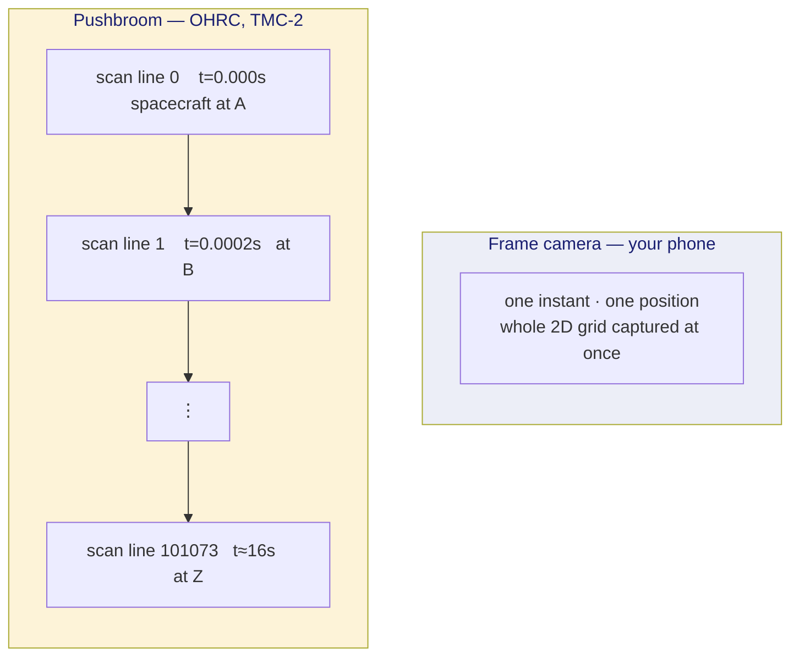
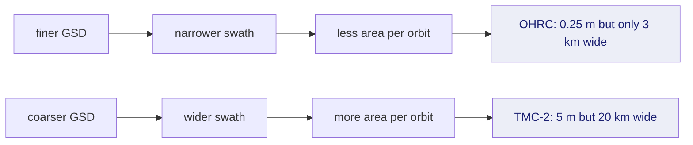
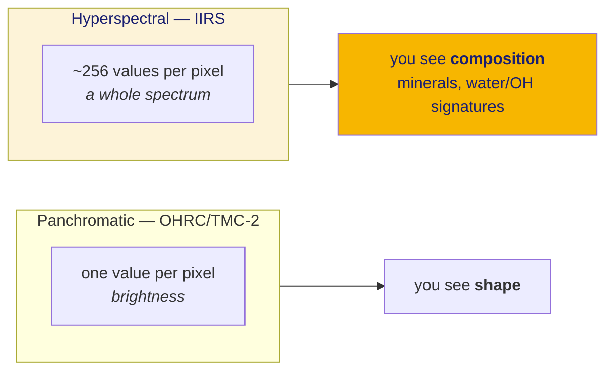

# 13 · How these cameras actually work

The single concept that most trips up a software engineer entering this field.

## Frame camera vs pushbroom

Your phone is a **frame camera**. One shutter click captures a whole 2D grid of
pixels, at one instant, from one position.

OHRC and TMC-2 are **pushbroom** sensors. They have a single *line* of
detectors, perhaps 12,000 pixels wide and one pixel tall. The spacecraft flies
forward and that line is read out thousands of times per second. Stack the
readings and you get a 2D image.



**Why this matters enormously:** every scan line has its own camera position and
orientation. A frame image relates to flat ground by *one* clean projective
transform. A pushbroom strip does **not** — there was no single viewpoint to
project from.

This is the direct cause of a 639 m error we measured. See doc 20.

## Real numbers from a real product

Our reference OHRC strip, read from its actual PDS4 label:

| property | value |
|---|---|
| lines (along-track) | **101,074** |
| samples (cross-track) | **12,000** |
| data type | `UnsignedByte` (1 byte per pixel) |
| file size | 1,212,888,000 bytes |

Note that `101074 × 12000 = 1,212,888,000` exactly. That arithmetic is how we
**cross-validated** that we were interpreting the binary layout correctly — a
guess that produces plausible wrong numbers is the specific hazard here.

At 0.25 m/px that strip is a ribbon roughly **3 km wide and 25 km long**,
captured in about 16 seconds.

## Ground sample distance (GSD)

**GSD** is how much ground one pixel covers. OHRC at 0.25 m/px means each pixel
is a 25 cm square of lunar surface.

It is *not* the same as "resolution" in the sense of the smallest thing you can
identify — you generally need several pixels across an object to recognise it.
A 1 m boulder is 4 pixels wide in OHRC: detectable, barely.

**Swath** is how wide the strip is, on the ground. OHRC's 12,000 samples ×
0.25 m ≈ 3 km.

Notice the trade-off that drives the whole mission design:



## Tri-stereo

TMC-2 is a **tri-stereo** instrument: it carries three lines looking forward,
straight down (nadir), and backward. As it flies, the same ground is imaged
three times from three angles.

That gives you **stereo parallax**, from which you can compute elevation — this
is how a Digital Elevation Model is made from orbit.

Practical consequence we hit: the filenames encode which look it is.

```
ch2_tmc_ncf_20260813T0627378557_d_img_d18   ncf = fore
ch2_tmc_ncn_20260813T0627378557_d_img_d18   ncn = nadir
ch2_tmc_nca_20260813T0627378526_d_img_d18   nca = aft
ch2_tmc_nrn_20260813T0627378557_d_img_d18   nrn = raw nadir
```

Same timestamp. So **"500 TMC-2 products" is nearer 125 scenes.** Counting
products as distinct coverage overstates it roughly 4×. (Inference from naming
and matching timestamps — not confirmed against the labels.)

## Hyperspectral: IIRS is not an image

OHRC and TMC-2 are **panchromatic** — one broad grey channel, like a
black-and-white photo.

IIRS is **hyperspectral**: roughly 256 narrow wavelength bands from 0.8 to 5 µm,
at every 80 m ground cell. The product is a **cube**: two spatial dimensions
plus one spectral.



Two consequences for us:

1. **You cannot match a cube against a grey image directly.** The cube must be
   reduced to one comparable channel first — by selecting a band, or combining
   bands. Doc 31 covers the choice.
2. **IIRS spans a physical boundary.** Below roughly 2.5 µm it measures
   *reflected sunlight*, like a camera. Above roughly 3 µm it increasingly
   measures *thermal emission* — the surface glowing with its own heat. Those
   are different physics, and a "thermal image" of a crater does not look like a
   sunlit one: shadows are warm-ish, not black.

## Band interleaving — a silent-wrongness trap

A cube is 3D but a file is 1D, so the bytes must be ordered somehow:

| layout | meaning |
|---|---|
| **BSQ** band-sequential | all of band 1, then all of band 2, … |
| **BIL** band-interleaved-by-line | line 1 of every band, then line 2 of every band, … |
| **BIP** band-interleaved-by-pixel | all bands of pixel 1, then all bands of pixel 2, … |

Read a BSQ cube as BIL and you get **no error** — just wrong per-band values.
That is why `ingest/pds4.py` surfaces `axis_order` explicitly rather than
assuming, and why the field map records provenance per field.
