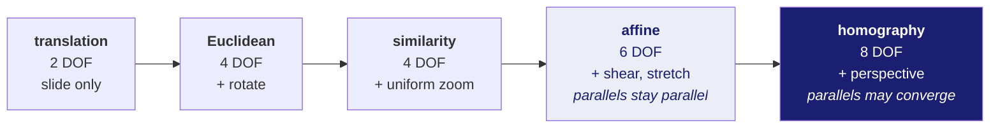
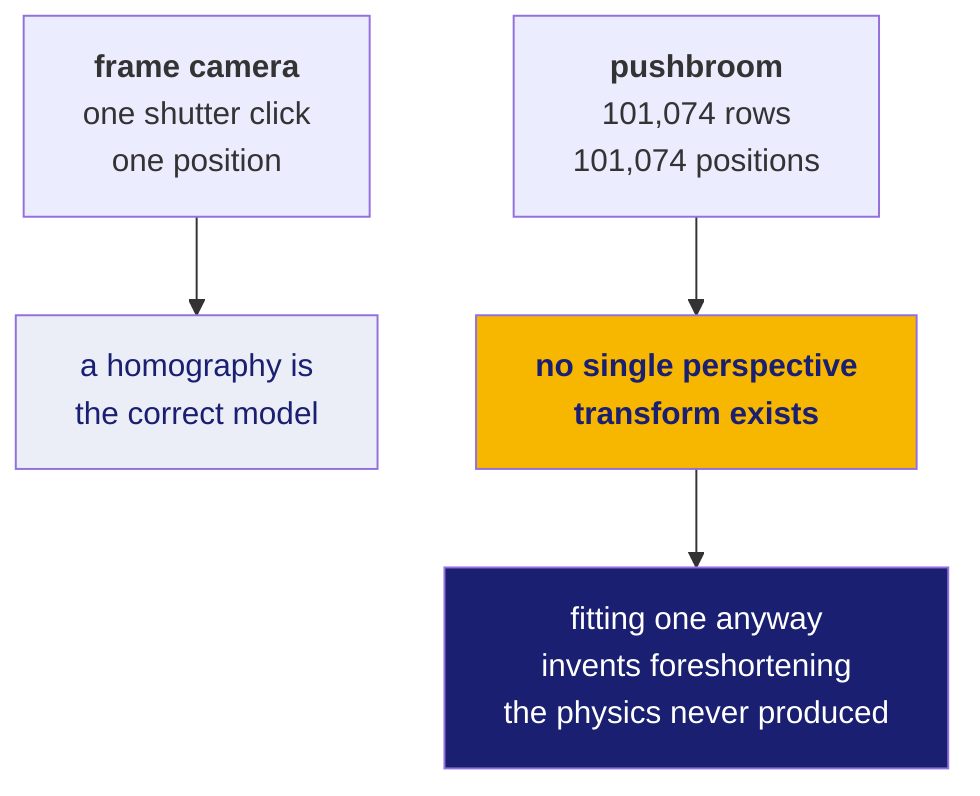

# 20 · Transforms — the thing registration actually produces

**New words in this doc:**

| word | plain meaning |
|---|---|
| **transform** | a function that takes a point in one image and returns where that point is in the other image. The output of registration. |
| **degrees of freedom (DOF)** | how many independent numbers you must solve for. Also the minimum amount of evidence you need. |
| **affine** | a transform that can shift, rotate, scale and shear, but keeps parallel lines parallel. |
| **homography** | affine plus perspective. Parallel lines may converge, as railway tracks do. |
| **projective** | another word for homography. |
| **warp** | to actually apply a transform to an image and produce a new, resampled image. |
| **foreshortening** | things farther away appearing compressed. A perspective effect. |

---

## What you are solving for

Registration's output is a function:

```
(x, y) in the source image  →  (x', y') in the reference image
```

Everything else — the matching, the RANSAC, the metrics — exists to find that
function and to say how much you should believe it.

## The ladder of transforms



Each matched point pair gives you **two** equations — one for `x`, one for `y`.
So the minimum number of matches is DOF ÷ 2: three pairs for an affine, four for
a homography.

More flexibility is not better. A more flexible transform fits your matches more
closely *and* fits their errors more closely. This is exactly overfitting, in the
sense you already know from machine learning. The right choice is the least
flexible transform that the physics justifies.

## Affine

```
x' = a·x + b·y + c
y' = d·x + e·y + f
```

Six numbers. `c` and `f` are the shift; the other four handle rotation, scale
and shear together.

## Homography, and the two numbers that change everything

```
      a·x + b·y + c                d·x + e·y + f
x' = ----------------      y' = ----------------
      g·x + h·y + 1                g·x + h·y + 1
```

The entire difference is the denominator. Set `g = h = 0` and it collapses back
to affine. Leave them nonzero and the denominator varies across the image, which
compresses one side relative to the other. That is perspective.

A homography is exactly right for a **flat scene** photographed from a **single
viewpoint**. Both conditions matter.

## The 639-metre finding

Here is the project's most important geometric result, and the reason doc 13
exists.

OHRC does not have a single viewpoint. It is a **pushbroom** sensor: one row of
detectors, read out over and over while the spacecraft flies forward. Our real
strip is 101,074 rows captured over roughly 16 seconds. Every row was taken from
a *different place*.



So: what happens if you fit a homography to the four footprint corners anyway,
which is the obvious thing to do and what the pipeline originally did?

**Measured**, by comparing that homography against the per-pixel geometry grid
ISRO ships (doc 30), and reproduced independently straight from the raw CSV with
none of the project's own code in the loop:

> **Median disagreement: 2554.6 pixels. At 0.25 m/px that is 639 metres.**

Not a rounding difference. Two thirds of a kilometre, on a project whose
requirement is *sub-pixel*.

The mechanism: `getPerspectiveTransform` on four corners of a trapezoid-shaped
footprint has no way to know the trapezoid is caused by the spacecraft's motion
rather than by perspective. It fits perspective, because that is the only tool it
has, and produces a smooth along-track distortion that does not exist.

## Affine versus homography, and a correction worth keeping

An intermediate question: if homography is wrong, is affine better? Sometimes,
because affine at least refuses to invent perspective.

**Measured, and product-dependent:**

| product | affine vs homography difference |
|---|---|
| TMC-2 frame | roughly **20×** |
| OHRC strip | **2.4×** |

I initially quoted the ~20× figure as a general property. It is not — it was
measured on TMC-2, and OHRC behaves quite differently because its footprint has a
different shape and aspect ratio. Stated as a range with the products named,
rather than as one impressive number.

## What to do instead

Use the per-pixel geometry grid. It is a lookup table from image position to
ground position, sampled densely across the whole strip, so it never assumes a
single viewpoint exists.

`ingest/geometry_grid.py` provides it, and **deliberately cannot return a 3×3
matrix**. Offering one would invite the exact mistake the module exists to
prevent.

**Open decision, for a human.** Wiring the grid into `ingest/overlap.py` in place
of the four-corner homography has not been done. The justification is measured
and strong — 639 m — but the change alters **every crop the pipeline produces**,
so it should be a deliberate, reviewed change rather than something that
appears in a diff. It is recorded in `CONTEXT_HANDOFF.md` as awaiting a decision.

## The general lesson

The transform you fit should be justified by the *physics of how the image was
made*, not chosen because a library function was available. `getPerspectiveTransform`
will happily accept four points from a sensor that has no perspective. It will
return a matrix. The matrix will be wrong by 639 metres, and nothing in the
program will say so.
