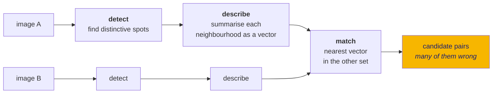
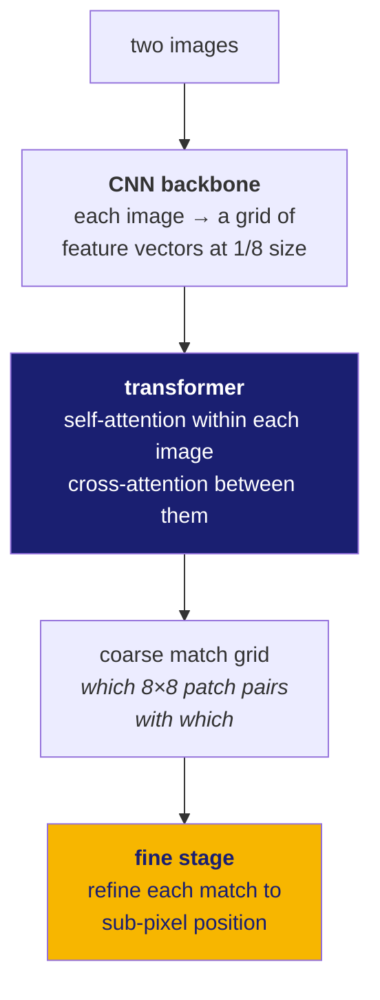

# 21 · Finding the same point in two pictures

**New words in this doc:**

| word | plain meaning |
|---|---|
| **feature / keypoint** | a specific spot in an image that a program has decided is distinctive enough to find again. |
| **detector** | the part that decides *where* the keypoints are. |
| **descriptor** | a short vector summarising what the neighbourhood around a keypoint looks like, so it can be compared to neighbourhoods in another image. |
| **invariant** | unchanged by some transformation. "Rotation-invariant" means turning the image does not change the descriptor. |
| **gradient** | how fast brightness changes, and in which direction. Most classical descriptors are built from these. |
| **detector-free** | skips keypoint selection entirely; compares everything to everything. |
| **attention** | a neural mechanism where each element decides which other elements are relevant to it. |
| **zero-shot** | using a pretrained model with no training of your own. |

---

## The task

Given two images of the same place, output a list of pairs:

```
(x₁, y₁) in image A   ↔   (x₂, y₂) in image B
```

Feed those pairs to doc 22 and you get a transform.

## The classical recipe



**SIFT** (1999) is the canonical version and still a strong baseline. It builds
its descriptor from a histogram of brightness **gradients** around the keypoint,
normalised for rotation and scale.

**AKAZE** and **ORB** are faster variants with different trade-offs. All three
are in this project as baselines, in the same harness as the neural matchers.

## Why the classical recipe fails on the Moon

SIFT's descriptor is a summary of *which way brightness increases*. Now recall
doc 01: the Moon has no atmosphere, so shadows are hard-edged and black, and when
the sun moves round a crater the lit wall becomes the dark wall.

The descriptor is built from precisely the thing that inverted.

**Measured** on synthetic scenes with a known-correct answer
(`eval/error_budget.py`), counting only geometrically-correct matches:

| sun azimuth difference | SIFT matches that are actually right |
|---|---|
| 15° | 228 |
| 30° | 4 |
| **60°** | **0** |

That is not gradual degradation, it is a cliff between 15° and 30°. And it is the
central experimental result justifying everything else in the project — without
this table, "we used a neural matcher" is a fashion choice rather than a
conclusion.

The technical name for the underlying problem is **nonlinear radiation
distortion**: the relationship between the two images' brightness values is not
a straight line you can undo with a contrast adjustment. In places it genuinely
inverts.

## The neural approach

### LoFTR — the main matcher here

**Detector-free.** It never asks "is this a corner". It compares everything to
everything, which is why it works on smooth lunar terrain where corner detectors
find nothing to detect.

Two stages:



- **Self-attention** lets each patch see the rest of its own image, so it knows
  its context, not just its 16 pixels.
- **Cross-attention** lets each patch in A look at every patch in B and decide
  which ones resemble it.

It is the same attention mechanism as a language model, run over image patches
instead of words. That is a true and useful sentence to have ready.

**The cost.** Comparing everything to everything means a table of size
`(S/8)² × (S/8)²` for an `S`-pixel tile, which grows as **S⁴**. Double the tile,
sixteen times the memory for that term. This is why the pipeline tiles images
instead of feeding whole strips, and why `MAX_DENSE_TILE_PX = 1408` is a hard cap
rather than a tuning knob. Doc 60 Part 5 has the algebra; doc 70 has the system
consequences.

### DISK + LightGlue — the sparse alternative

**DISK** is a CNN that finds and describes keypoints — SIFT's job, learned.
**LightGlue** takes two sets of keypoints and decides which pair with which,
using attention over the keypoints as a graph: "these four already match, so this
fifth one probably does too."

Memory grows with the **number of keypoints squared**, not with image area
squared. That is far cheaper, so this family tolerates much larger tiles. The
trade: matches are sparser and cluster on high-texture structure, which on smooth
mare terrain leaves gaps that the uniformity metric (doc 23) will correctly
penalise.

### SuperPoint + SuperGlue — present, and gated

The strongest performer in the benchmark paper we compare against. It is wrapped
in `match/superglue.py` behind an explicit acknowledgement, and its weights are
never vendored, because its licence is **"academic or non-profit, noncommercial
research use only"** and includes a clause assigning ownership of derivatives to
the licensor. It can be run for comparison. It cannot ship in a submission.

Handling that in code, with the reasoning written down, is better than
discovering it during a submission review.

### RIFT2 — the cross-modal classical baseline

Built on **phase congruency** rather than gradients. Phase congruency responds to
where image structure *lines up across scales*, which is a property that survives
brightness inversion better than a gradient does. That makes it the most relevant
classical baseline for the cross-modal OHRC↔IIRS case.

It is a **clean-room implementation** in `match/rift2/` — written from the paper,
not ported — because every existing implementation is unlicensed. No licence
means all rights reserved by default, which is worse than a restrictive licence,
not better.

## No training happens here

Every neural weight in this project was trained by someone else on terrestrial
imagery and is used **zero-shot**. There is no training loop, no optimiser, no
dataset class.

That is a deliberate decision with a stated reason: it is what makes "a working
proof of concept in days on one consumer GPU" true. Doc 61 covers what training
*could* add, what it would need, and which ideas are honest versus decorative.

## Tiling, and the seam problem

Because LoFTR cannot see a whole strip, images are cut into tiles. Tiles
**overlap on purpose**: a feature near a tile edge has a truncated neighbourhood,
so without overlap the match field develops regular gaps along the seams —
exactly the clustering the uniformity requirement penalises.

Overlap has its own cost: a feature inside an overlap region gets matched once
per tile containing it, producing duplicates that

- inflate the match count, making results look better than they are;
- bias RANSAC, because a duplicated match votes twice and the overlaps form a
  regular grid, so the bias is *systematic* rather than random;
- skew the uniformity metric, since duplicates land in a lattice.

`match/stitch.py` merges and de-duplicates. It is not an afterthought — getting
it wrong corrupts all three headline metrics at once.
