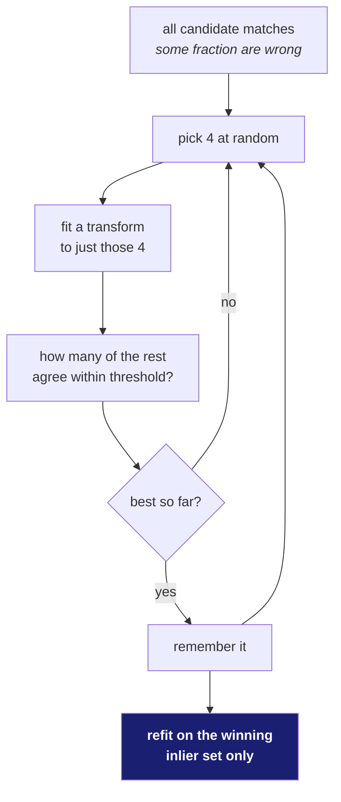

# 22 · Fitting a transform when some of your data is wrong

**New words in this doc:**

| word | plain meaning |
|---|---|
| **inlier** | a matched pair that agrees with the transform. Good data. |
| **outlier** | a matched pair that does not. A wrong match. |
| **least squares** | fit by minimising the sum of squared errors. Fast, closed-form, and destroyed by a single bad point. |
| **robust** | a method whose answer is not ruined by a minority of bad inputs. |
| **consensus** | agreement. RANSAC's core idea: the right answer is the one most of the data agrees with. |
| **closed form** | solvable in one direct calculation, no iteration. |
| **sub-pixel** | accurate to less than the width of one pixel. The problem statement's requirement. |

---

## Why plain least squares is not enough

Least squares finds the transform minimising

```
Σ ‖ T(pᵢ) − qᵢ ‖²
```

— apply the transform to each source point, measure how far it lands from where
it should, square it, add them up, minimise. It is closed-form and fast.

The squaring is the problem. A match that is wrong by 500 pixels contributes
250,000 to the total, while a hundred good matches wrong by 1 pixel contribute
100 between them. The bad point wins. One outlier drags the entire fit.

And on lunar terrain outliers are **not** rare noise. Craters genuinely look like
other craters. A wrong match can be visually perfect and confidently scored.

## RANSAC

**RAN**dom **SA**mple **C**onsensus. The insight is to stop trying to use all the
data and instead guess repeatedly:

```
best_transform = none
best_inlier_count = 0

repeat N times:
    pick the MINIMUM number of matches at random      # 4 for a homography
    fit a transform to exactly those
    count how many of ALL matches this transform explains
        within `threshold` pixels          → the inliers
    if that count > best_inlier_count:
        keep it

# finally, refit properly using every inlier of the winner
final = least_squares(best_inlier_set)
```



Why sampling the *minimum* number: a sample of 4 has a decent chance of being
all-good. A sample of 100 almost certainly contains an outlier.

## The two knobs, and how to set them

**Inlier threshold**, in pixels. How close counts as agreeing. Too tight and a
correct transform gets rejected because of ordinary noise; too loose and
outliers get absorbed into the "consensus" and corrupt the final fit. It should
be set from your expected measurement noise, not tuned until the answer looks
nice.

**N**, the iteration count. This one has a formula rather than a guess:

```
N = log(1 − p) / log(1 − (1 − ε)ˢ)
```

- `p` — the probability you want of drawing at least one all-inlier sample, e.g. 0.99
- `ε` — the fraction of your matches that are outliers
- `s` — the sample size (4 for a homography)

| outlier fraction ε | N needed for p = 0.99 |
|---|---|
| 20% | 11 |
| 50% | 72 |
| 70% | 588 |
| **80%** | **4,715** |

The explosion at high outlier rates is the practical argument for a matcher that
returns **fewer but cleaner** matches over one that returns many dirty ones. It
is also why a learned confidence filter before RANSAC would be valuable (doc 61,
Tier 2C).

## Getting to sub-pixel: ECC

RANSAC plus least squares gets you close. The problem statement asks for
**sub-pixel**, and matched points are quantised to roughly pixel resolution, so a
different kind of method is needed for the last step.

**ECC** — Enhanced Correlation Coefficient — ignores matched points entirely and
works directly on brightness values. It searches for the transform maximising the
correlation between the two images' pixels:

```
                    Σ (aᵢ − ā)(bᵢ − b̄)
ECC(a, b)  =  ------------------------------
              sqrt( Σ(aᵢ − ā)² · Σ(bᵢ − b̄)² )
```

This is the Pearson correlation coefficient, from −1 to +1. Because each image's
mean is subtracted and the result is divided by the magnitudes, the score is
**unchanged if you brighten or contrast-stretch either image**. That invariance
to `new = α·old + β` is exactly why ECC was chosen for imagery taken under
different lighting.

It optimises iteratively from a starting guess, so it needs RANSAC's answer to
start from — it refines, it does not search globally.

## Where ECC breaks here, stated as a defect rather than tuned away

ECC is invariant to **linear** brightness change. Lunar illumination change is
**not linear** — the lit wall becomes the dark wall (doc 01). So ECC's
invariance does not cover our hardest case.

`align/refine.py` therefore has a prefilter stage:

```python
ECC_PREFILTERS = ("auto", "local_contrast", "none")
ECC_SAME_ILLUMINATION_NCC = 0.97
```

`local_contrast` normalises brightness within small windows, which suppresses
large-scale shading differences while keeping local structure. The `auto` mode
was meant to choose between prefilters by measuring how similar the two images
already are.

**Measured, and negative.** The `auto` heuristic cannot distinguish *sensor
noise* from *illumination change* — both lower the correlation score. On a
deliberately noisy test pair it scored **0.917**, fell below the 0.97 threshold,
and chose the wrong prefilter.

So it ships **disabled**, with `refine_transform_ecc(prefilter="none")` as the
default and the defect documented in the module.

This is a deliberate choice: shipping a broken heuristic that is honestly
labelled is better than tuning the threshold until the test passed. Tuning would
have hidden the fact that the *signal itself* is insufficient — no threshold on
that statistic can separate the two causes, so the fix is a better statistic, not
a better number.

## Choosing which transform to fit

RANSAC needs to know what it is fitting. From doc 20: use the least flexible
transform the physics justifies.

- More degrees of freedom fit your matches better **and** fit their errors
  better. That is overfitting, in the ordinary sense.
- A homography on a pushbroom sensor invents perspective the physics never
  produced — measured at **639 m** of disagreement against ISRO's own per-pixel
  geometry.
- The number of matches also matters: 8 degrees of freedom estimated from twelve
  matches clustered in one corner is not a transform, it is a guess with a matrix
  around it. Doc 23's conditioning metric exists to detect exactly that.
