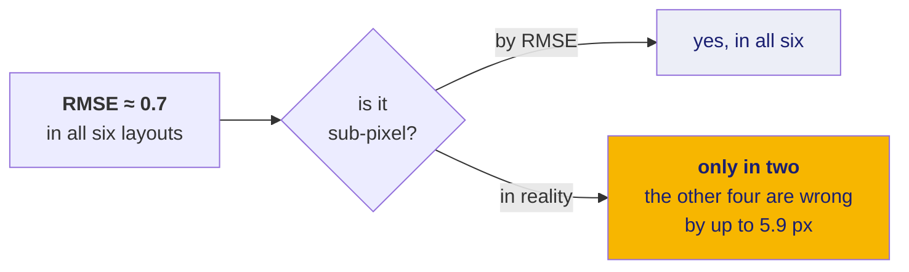

# 23 · Why RMSE lies, and what we measure instead

This is the most defensible original contribution in the project. If you present
one technical argument to a panel, make it this one.

**New words in this doc:**

| word | plain meaning |
|---|---|
| **RMSE** | Root Mean Square Error. Average miss distance, with big misses weighted more heavily. |
| **residual** | how far one point missed. |
| **interpolation** | predicting *inside* the region your data covers. Usually reliable. |
| **extrapolation** | predicting *outside* it. Usually not. |
| **entropy** | a measure of how evenly a quantity is spread. Maximum when everything is equal. |
| **nearest-neighbour distance** | for each point, the distance to the closest other point. |
| **bootstrap** | resample your own data many times, redo the analysis on each, and look at the spread of answers. |
| **Spearman correlation** | how well two rankings agree, from −1 to +1. Cares about order, not exact values. |

---

## What the problem statement asks for

> sub-pixel accuracy of source image **maintaining uniform distribution across
> the images**

Two requirements. ISRO suggests three metrics: RMSE, inlier count, inlier ratio.

**None of the three can measure the second requirement.** That gap is the
project's opening.

## RMSE, and why it is not accuracy

```
RMSE = sqrt( (1/n) · Σ ‖ T(pᵢ) − qᵢ ‖² )
```

Apply the transform to each matched source point, measure the distance to where
it should have landed, square, average, square-root.

The problem: **these are the same points the transform was fitted to.** Least
squares chose the transform that makes this exact number small. In machine
learning terms it is *training error* being reported as model accuracy.

## The experiment that proves it

Six different spatial layouts of matched points. **All six have exactly 400
points and identical 0.5-pixel noise.** The *only* thing that differs is where
the points are.

**Measured** (`eval/uniformity.py`, on the synthetic homography benchmark, which
has a known correct answer so true error is knowable):

| layout | fit RMSE | true error at probe points | worst case |
|---|---|---|---|
| even grid | 0.698 | 0.049 | 0.114 |
| uniform random | 0.699 | 0.071 | 0.142 |
| one quadrant | 0.701 | 0.309 | 0.768 |
| two clusters | 0.705 | 0.390 | 1.092 |
| diagonal band | 0.717 | 0.999 | 2.393 |
| **tight blob** | **0.724** | **1.653** | **5.861** |

Read the first column: RMSE spans **0.698 to 0.724**. Essentially constant.

Read the last column: true worst-case error spans **0.114 to 5.861 pixels** — a
**51× range**.

The bottom row is the whole argument. A tightly clustered solution reports
**sub-pixel RMSE (0.724)** while being **nearly six pixels wrong** elsewhere in
the same image. If you report RMSE alone, you can satisfy the problem
statement's stated metric while comprehensively failing its stated requirement.



## The proposed uniformity metric

Four numbers, because every single one of them can be fooled on its own.

### Coverage, `C`

Divide the image into a `g × g` grid. `C` = the fraction of cells containing at
least one match. Directly measures **regional absence**, which is what forces the
transform to extrapolate.

**Why not this alone:** 64 occupied cells with 5,000 points in one and 1 in each
of the rest gives `C = 1.0`, which looks perfect and is not.

### Normalised entropy, `H`

Shannon entropy of the per-cell counts, divided by `log(g²)` so the scale runs
0 to 1. Measures **density skew among the cells that are occupied**.

`H = 0.03` for the case that fooled coverage. Caught.

**Why not this alone:** four cells at 25% each and sixty empty gives `H = 0.33`,
which is unalarming — while `C = 0.06` is emphatic. The two fail on opposite
inputs.

### Headline score, `U`

```
U = sqrt(C · H)
```

A **geometric mean**, not an average, chosen deliberately: with a mean, a
near-zero in one component gets averaged away by a healthy other one. With a
geometric mean it drags the whole score down, which is the behaviour you want
from a gate.

```python
UNIFORMITY_GATE = 0.7
```

**Calibrated, not guessed:** the layouts scoring below 0.7 had worst-case errors
of **0.77 px and up**; those above scored **0.14 px**.

### Clark–Evans index, `R`

Grid-free, and it catches what grids cannot. For each match, measure the distance
to its nearest neighbour. Average those. Divide by what that average would be if
the same number of points were scattered completely at random over the same area.

| `R` | meaning |
|---|---|
| < 1 | **clustered** |
| ≈ 1 | random |
| > 1 | dispersed — evenly spread, which is what we want |

**Why it is needed:** 512 points arranged as 64 tight blobs, one per grid cell,
scores `C = 1.00`, `H = 1.00`, `U = 1.00` — indistinguishable from an ideal
spread. Clark–Evans gives `R = 0.101`, correctly reporting severe clustering.
Both grid metrics are blind to arrangement *inside* a cell.

### And a decision that matters more than it looks

**`R` is deliberately not used as a gate.** Real detectors always clump at fine
scale. **Measured** inlier sets from the real matchers:

| matcher | `R` |
|---|---|
| SIFT | 0.63 |
| ASIFT | 0.29 |
| AKAZE | 0.32 |
| RIFT2 | 0.24 |

All four sit below the `CLUSTERED_R = 0.25` diagnostic line or near it, and all
four had healthy coverage. Any threshold strict enough to catch the blob case
would reject **every real result**.

So `R` is reported as a **diagnostic**, and the actionable signal is
*disagreement between the metrics*: a high `U` together with a low `R`, exposed
as `grid_contradicted_by_neighbours`. That is a genuinely better design than
adding a fourth threshold — the interesting event is the two measures telling
different stories.

### Why the grid is 8×8

```python
DEFAULT_GRID = 8        # 64 cells
PROFILE_GRIDS = (4, 8, 16)
```

64 cells is **eight times** the 8 degrees of freedom of a homography. The metric
exists to measure whether the correspondences constrain the transform, so the
cell count should comfortably exceed the parameter count being constrained. Much
finer and per-cell counts become sampling noise rather than signal.

Uniformity is also **scale-dependent** — a set that is even at 4×4 can be
clustered at 16×16 — so `uniformity_profile()` reports across all three grids
rather than one.

### Is the metric any good? A stated validation

**Measured:** `U` ranks the six layouts in the same order as their worst-case
error, **Spearman −0.83**.

That number is the evidence for using `U` as a gate, and it is stated because a
proposed metric with no validation is an opinion. Negative because higher
uniformity should mean lower error.

## Bootstrap conditioning: a map, not a number

The last and least conventional piece. The question: **how much does the fitted
transform depend on the particular matches we happened to get?**

```
for b in 1..B:                          # DEFAULT_N_BOOTSTRAP = 40
    resample n matches, WITH REPLACEMENT, from the n you have
    refit the transform on that resample
    apply it to a fixed grid of probe points
spread = standard deviation of each probe point's position across the B fits
```

"With replacement" means the same match can be drawn twice and another not at
all — that is what makes each resample a plausible alternative version of the
data you might have got.

```python
DEFAULT_PROBE_GRID = 24
EXTRAPOLATION_GATE_PX = 1.0
```

Any region where the spread exceeds 1 pixel is flagged: there, the transform is
**extrapolating** rather than interpolating, and its answer should not be
trusted regardless of how good the global RMSE looks.

The output is a **map of where the answer is reliable**, not a single number.
That is a strictly stronger statement than any scalar metric can make, and it
addresses the "*across the images*" half of the problem statement directly —
which is precisely the half RMSE cannot see.

## What we report, and why each one is there

| metric | what it catches | what it misses |
|---|---|---|
| RMSE | overall fit quality | everything about *where* — the 51× range above |
| inlier count | whether matching worked at all | clustering |
| inlier ratio | matcher precision | clustering |
| **coverage `C`** | empty regions | crowding within a cell |
| **entropy `H`** | density skew | empty regions |
| **`U = sqrt(C·H)`** | both at once | fine-scale clumping |
| **Clark–Evans `R`** | clumping at any scale | a large empty region |
| **bootstrap conditioning** | *where* the transform is untrustworthy | — it is the map |

## The one-sentence version

The problem statement asks for sub-pixel accuracy *across the image*; its
suggested metrics measure accuracy *at the points you already fitted to*; and we
measured a case where those two things differ by **51×**, so we built metrics
that measure the requirement rather than the proxy.
