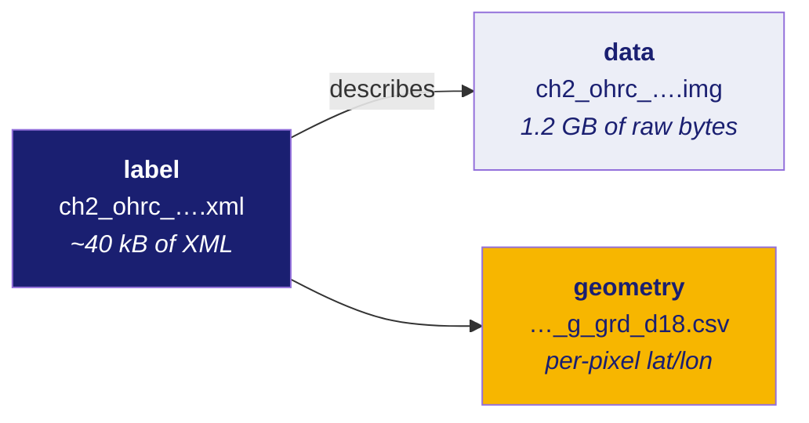

# 30 · How the data arrives: PDS4 and PRADAN

**New words in this doc:**

| word | plain meaning |
|---|---|
| **PDS** | Planetary Data System. NASA's archive standard for planetary mission data. **PDS4** is version 4 of it, XML-based. |
| **label** | the metadata file. In PDS4 it is an XML document. It is *separate* from the data file it describes. |
| **product** | a label plus the data file(s) it describes, treated as one unit. |
| **namespace** | in XML, a prefix that says whose vocabulary an element name comes from, so two organisations can both define `<latitude>` without colliding. |
| **band** | one channel of a multi-channel image. |
| **BSQ / BIL / BIP** | three different orders for writing multi-band pixels to disk. Getting this wrong produces plausible wrong numbers, not an error. |
| **PRADAN** | ISRO's data portal (`pradan.issdc.gov.in`), where Chandrayaan-2 products are downloaded. |

---

## The shape of a PDS4 product

A product is **at least two files**: an XML label and a raw binary blob.



The `.img` file has **no header**. It is pure pixel bytes. Everything you need to
interpret it — how many rows, how many columns, how many bytes per pixel, in what
order — lives in the XML. Read the wrong number from the XML and you will parse
1.2 GB of bytes into a picture of noise, with no error raised anywhere.

## The one non-negotiable rule when writing a loader

**Never invent field names or binary layouts from memory.**

The reason is that a wrong guess does not fail loudly:

- A parser looking for the wrong XML element name returns `None`. The column in
  your table is empty, which is indistinguishable from a value genuinely absent
  from the product.
- A wrong band layout is worse: reading a band-sequential cube as
  band-interleaved raises no error at all. It returns numbers. They are wrong.

So the approach here is a declarative field map where **every field carries its
own provenance**, in `ingest/fieldmap.py`:

| provenance | meaning |
|---|---|
| `VERIFIED` | confirmed against a real Chandrayaan-2 label we opened |
| `DOCUMENTED` | comes from the published PDS4 standard, not yet seen in one of our files |
| `UNVERIFIED` | a plausible guess. Not trusted. |

**Measured, after running the probe tool against a real OHRC label:**
**12 VERIFIED, 5 DOCUMENTED, 6 UNVERIFIED** — 22 of 25 fields resolved.

The provenance lives in the code, as an enum on each field, rather than in a
comment at the top of the module. A prose disclaimer does not survive somebody
copying the output into a report; a per-field enum does.

## What the probe found, and why guessing would have failed

The strategy that unblocked this was not "find a sample file and wait". It was
**ship a probe command** that dumps a real file's actual structure and prints a
ready-to-paste corrected mapping. That turns a blocker into a two-minute task.

Two concrete results:

**ISRO does not use the name you would guess.** The solar incidence angle — how
far the sun is from straight overhead — is stored as `solar_incidence`, not
`incidence_angle`. The original guess used `incidence_angle` and silently found
nothing. The observed value was **83.270815°**, which is exactly 90° minus the
sun elevation on the same label — an internal consistency check that confirms we
read the right field rather than a coincidentally-named one.

**Two fields are simply not there.** `emission_angle` and `phase_angle` are
absent from the reference OHRC label. They stay `UNVERIFIED` and the test suite
pins that:

```python
STILL_UNVERIFIED = {"emission_angle_deg", "phase_angle_deg"}
```

An earlier version of that test asserted *all* geometry fields were unverified.
Once the probe verified thirteen of them, the guard test was **inverted** rather
than deleted — it now asserts that exactly the two genuinely-unconfirmed fields
remain unverified. The test still fails loudly if someone promotes a field
without evidence.

## Cross-validating the binary layout

The XML says 101,074 lines × 12,000 samples × 1 byte. The `.img` file is
1,212,888,000 bytes.

```
101,074 × 12,000 × 1 = 1,212,888,000        ✓ exact
```

That arithmetic is **evidence**, not a formality. If the layout interpretation
were wrong — extra header bytes, two bytes per pixel, a different row count — the
product would not come out exact. It is the cheapest possible check and it is
the difference between "we believe we parsed it" and "we confirmed we parsed it".

## The `isda` namespace

ISRO extends the PDS4 standard with its own elements, under the namespace:

```
https://isda.issdc.gov.in/pds4/isda/v1
```

Practical consequence: a generic PDS4 reader will parse the *standard* parts of
an ISRO label fine and will not know what to do with the ISRO-specific parts —
which include the solar geometry and the corner coordinates, i.e. everything this
project needs. You have to handle the `isda` namespace explicitly.

## The per-pixel geometry file, and why it beats the corners

Alongside the image, ISRO ships a geometry grid: a CSV named `…_g_grd_d18.csv`
with columns

```
Longitude, Latitude, Pixel, Scan
```

This is a **lookup table from image position to ground position**, sampled on a
grid — not four corners, but thousands of anchor points across the whole strip.
`ingest/geometry_grid.py` reads it and provides `pixel_to_lonlat()` and
`lonlat_to_pixel()` (the reverse direction needs a nearest-neighbour search
followed by Newton's method to refine, because the mapping has no closed-form
inverse).

**Why it matters, measured:** the four-corner approach fits a single perspective
transform to the footprint. Compared against this per-pixel grid, that transform
is off by a **median of 2554.6 pixels — 639 metres** at 0.25 m/px. Doc 20
explains why: a pushbroom sensor has no single viewpoint, so no single
perspective transform can describe it.

Deliberately, `lonlat_to_pixel()` **cannot** return a 3×3 transform matrix. The
whole point is that the relationship is not expressible as one. An API that
offered a matrix would invite exactly the error it exists to avoid.

## PRADAN: what downloading actually involves

PRADAN is ISRO's data portal. Two things to know before you plan around it.

**First: what you get is scripts, not data.** Adding products to a cart and
"downloading" produces a `.sh` or `.py` file containing a list of `wget`
commands — one per file — plus a keepalive loop. The actual bytes come later,
from running it.

**Second, and this is a security matter: those scripts contain live session
cookies in plaintext.** Values like `FGTServer=…` and `JSESSIONID=…` are embedded
directly in the `wget` commands. Those are **credentials**. Treat the download
script exactly as you would treat a password:

- never commit it to a repository;
- never paste it into an issue, a chat, or a document;
- assume it expires — it is tied to a browser session that must stay logged in.

The `.gitignore` in this repo excludes `data/raw/` for a related reason (the
products are large and redistributable only under ISSDC terms), but the download
script itself is the sharper hazard because it is small enough to be committed by
accident.

**A practical note, measured:** the IIRS `.py` and `.sh` carts were
**byte-identical in content** — the same file list, two wrappers. And the full
cart came to roughly **975 GB against 830 GB of free disk**, which is the kind of
thing worth checking before starting rather than discovering at 96%.

## The datum question, unresolved

The geometry label describes its coordinates as *"selenographic"* — Moon-relative
— and provides **no unit** and **no coordinate-system element**. Whether the
latitudes are planetocentric or planetographic (doc 10) is not stated.

While every product in a comparison is Chandrayaan-2, this cancels out. It stops
cancelling the moment LRO enters, which is the plan. Recorded in
`docs/project/CONTEXT_HANDOFF.md` as an open decision for a human, not resolved by assumption.
