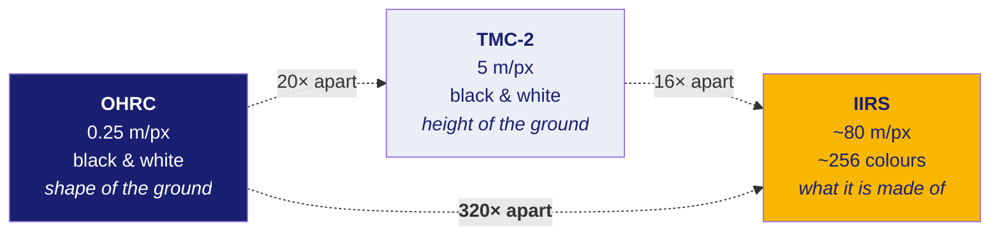
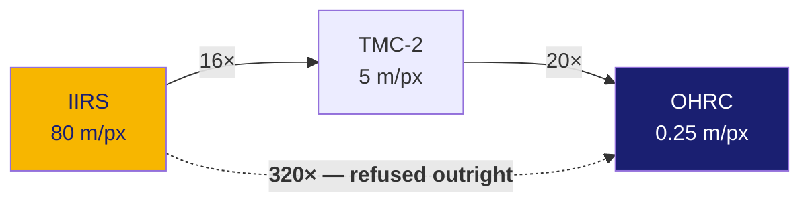

# 31 · The four cameras

Read doc 13 first — it explains how these cameras take a picture, which is not
how a phone takes one.

**New words in this doc:**

| word | plain meaning |
|---|---|
| **payload** | an instrument carried by a spacecraft. A satellite is a bus with payloads bolted on. |
| **GSD** | Ground Sample Distance — how much ground one pixel covers. "0.25 m/px" means one pixel is a 25 cm square of Moon. |
| **panchromatic** | one single brightness channel covering a wide range of light. A black-and-white photo. No colour information at all. |
| **spectral band** | a narrow slice of wavelengths. Ordinary colour photos have 3 (red, green, blue). IIRS has about 256. |
| **swath** | how wide a strip of ground the camera sees in one pass, measured across the direction of travel. |
| **stereo** | two or more pictures of the same ground from different angles. The apparent shift between them gives height, the same way your two eyes give depth. |
| **georeferenced** | the file knows where on the body each pixel is. Without this, an image is a picture; with it, it is a map. |
| **nadir / fore / aft** | looking straight down / looking forward along the flight path / looking backward. |

---

## The three Chandrayaan-2 payloads named in the problem statement



Read the dotted arrows as: how many times bigger one camera's pixel is than the
other's. A 320× difference means one IIRS pixel covers the same ground as about
**100,000** OHRC pixels (320 × 320).

### OHRC — Orbiter High Resolution Camera

The sharpest camera flown to the Moon at the time it launched. **0.25 metres per
pixel** — one pixel is a 25 cm square. At that resolution a 40 cm boulder is a
thing you can see, not a smudge in the texture.

It exists to check landing sites. You cannot land on a boulder you did not know
was there.

Three consequences that shape everything downstream:

- **It sees a very narrow strip.** 12,000 pixels across × 0.25 m = about
  **3 kilometres wide**. Then the spacecraft flies forward and it keeps
  recording, so the result is a long thin ribbon, roughly 3 km × 25 km. Two
  OHRC images only overlap if the two orbits nearly retraced each other.
- **The files are large.** **Measured** from a real product's label
  (`ingest/fieldmap.py`): 101,074 rows × 12,000 columns × 1 byte per pixel =
  **1,212,888,000 bytes**. Exactly 1.2 GB, for one image.
- **It is panchromatic** — a single brightness value per pixel. No colour, no
  chemistry. It tells you the *shape* of the ground and nothing else.

### TMC-2 — Terrain Mapping Camera 2

**5 metres per pixel**, and it looks three ways at the same time: forward
(*fore*), straight down (*nadir*), and backward (*aft*). Three views of the same
ground from three angles is **stereo**, and stereo gives you height — the same
trick your two eyes use, scaled up to a spacecraft.

So TMC-2's real product is an elevation model as much as it is an image.

**Measured, and this is a nice example of confirming something rather than
assuming it.** We downloaded three TMC-2 files whose names ended `nca`, `ncf`
and `ncn`. The names *suggested* they were a simultaneous fore/aft/nadir triple.
Reading their labels showed all three carry an **identical sun elevation of
50.935114°**. The sun does not stay at the same elevation across separate
orbital passes. Identical sun geometry is what turns "these names look like a
stereo triple" into "these are a stereo triple".

### IIRS — Imaging Infrared Spectrometer

**About 80 metres per pixel**, and roughly **256 spectral bands** from about
0.8 to 5 micrometres (µm — millionths of a metre; visible light runs about
0.4–0.7 µm, so all of this is beyond what your eye can see).

The key idea: every pixel is not a brightness, it is a **spectrum** — a curve of
brightness against wavelength. Different minerals absorb light at different
characteristic wavelengths, so the shape of that curve tells you what the ground
is made of. This is how you find water ice from orbit.

Three things make IIRS the hard case in this project:

1. **Scale.** 320× against OHRC. There is no feature to match between them —
   there is a *containment* relationship, where a hundred thousand OHRC pixels
   sit inside one IIRS pixel.
2. **Different physics.** Bands past about 3 µm see **emitted heat**, not
   reflected sunlight. A picture of how hot something is and a picture of how
   bright it is are not the same picture. Some features invert; some disappear
   entirely.
3. **No ground truth.** Nobody has published a set of known-correct
   OHRC↔IIRS point correspondences. Without those you cannot measure whether a
   matcher worked, and you cannot train one. That is why
   `ingest/pseudo_gt.py` exists — see doc 50 for how weak its output currently
   is, stated in metres.

---

## The reference camera: LRO

NASA's **Lunar Reconnaissance Orbiter**, in operation since 2009. Two cameras
matter to us:

| camera | GSD | why we care |
|---|---|---|
| **NAC** — Narrow Angle Camera | ~0.5 m/px | the natural reference for OHRC — only 2× apart, which a matcher can bridge |
| **WAC** — Wide Angle Camera | ~100 m/px | wide context, and roughly IIRS's scale |

**Why LRO is the reference and not just another image.** Registration needs one
side to be trusted. LRO's imagery has been reprocessed for over a decade against
**LOLA** (Lunar Orbiter Laser Altimeter — a laser that measures the distance to
the surface directly, so it produces heights that do not depend on any camera
model). That gives LRO products geometry that is far better constrained than any
single Chandrayaan-2 strip's. When our result and LRO disagree, LRO is right.

**Status, stated plainly:** no LRO product has been downloaded in this project.
Three public mirrors were confirmed reachable and no login is needed, but the
fetch has not been run. Every sentence in this repo about "registering against
LRO" is therefore a design intent, not a result.

---

## Why the pipeline refuses a direct OHRC↔IIRS match

`ingest/pseudo_gt.py` contains:

```python
MAX_DIRECT_SCALE_RATIO = 8.0
```

Above roughly 8× difference in pixel size, a feature matcher is no longer
comparing the same physical thing in both images. A crater that is a
well-resolved landform with a visible rim in one image is three grey pixels in
the other. There is nothing to match.

So `bridge_sensor()` inserts a middle step rather than attempting the jump:



Notice that **both hops are still above the 8× gate.** That is itself a finding,
not a solved problem: even the bridged route is uncomfortable, and each hop adds
its own error on top of the previous one. Doc 50 gives the accumulated number.

---

## Where these numbers come from

| instrument | GSD | provenance |
|---|---|---|
| OHRC | 0.25 m | **Documented** — mission literature; stored as `NOMINAL_GSD_M` |
| TMC-2 | 5 m | **Documented** |
| IIRS | ~80 m | **Documented** — the archive quotes about 80 m; it varies with orbital altitude |
| LRO NAC | 0.5 m | **Documented** |

These are **nominal** values — the design figures, not what any particular file
actually achieved. Real GSD changes with how high the spacecraft was and how far
off straight-down it was looking. For a real product, the per-pixel geometry file
described in doc 30 is authoritative and this table is not.
