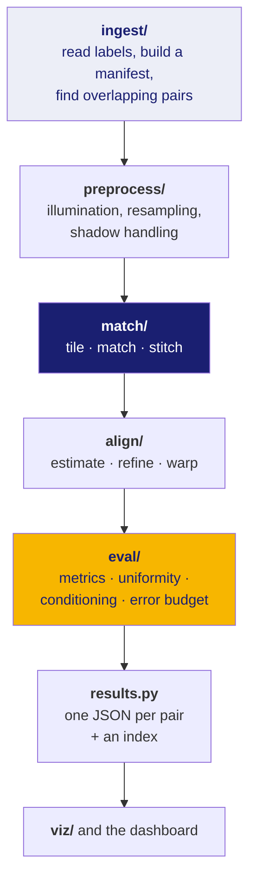

# 40 · Walking through the code

By this point you have the concepts. This doc maps them onto files.

The package lives in `src/lunar_reg/`. It installs as `lunar-reg` with a CLI
entry point. **431 tests pass, 1 skipped** (the skip needs a GPU), and `ruff`
is clean over `src/`, `tests/` and `scripts/`.

---

## The shape of a run



---

## `ingest/` — turning files into a work list

| file | what it does |
|---|---|
| `pds4.py` | reads the XML label |
| `fieldmap.py` | the declarative field map, with per-field provenance (doc 30) |
| `probe.py` | dumps a real file's actual structure and prints a corrected mapping |
| `footprint.py` | corner coordinates → a polygon on the sphere |
| `manifest.py` | one row per product, as a Parquet table |
| `overlap.py` | which products share ground, and how much |
| `geometry_grid.py` | the per-pixel lat/lon lookup table (doc 30) |
| `tiling.py` | cutting a strip into overlapping tiles |
| `pseudo_gt.py` | manufacturing weak ground truth where none exists |
| `lro.py` | fetching reference imagery — **written, never run** |

**The manifest is the source of truth.** Everything downstream reads it rather
than re-parsing labels. It carries **35 columns**, and importantly it carries all
**four corner coordinates**, not a bounding box — see doc 12 for the 3.9–4.2×
area error that fixing this removed.

**`overlap.py` classifies rather than filters.** Every pair gets an outcome, and
the run prints counts for all of them plus a sample of each — always, not only on
failure. Outcomes include `POLAR_EXTENT_UNSUPPORTED` and `POLAR_BBOX_UNUSABLE`,
which exist so that "we refused this pair for a stated reason" never looks like
"this pair had no overlap".

---

## `preprocess/` — making two images comparable

| file | what it does |
|---|---|
| `radiometric.py` | brightness normalisation |
| `shadow.py` | detecting and handling hard lunar shadow |
| `resample.py` | bringing two different pixel sizes to a common scale |
| `georeference.py` | applying known geometry |
| `hyperspectral.py` | reducing IIRS's ~256 bands to something matchable |
| `params.py`, `config.py` | the knobs |

**An honest note:** `params.py` holds **11 placeholder preprocessing parameters**
that are marked as reasonable defaults to tune, **not** as values matched to any
published paper. That labelling is deliberate. Choosing the final values is an
open item recorded in `CONTEXT_HANDOFF.md`.

---

## `match/` — the expensive part

| file | what it does |
|---|---|
| `base.py` | the `MatchResult` type every matcher returns |
| `classical.py` | SIFT, AKAZE, ORB |
| `rift2/` | clean-room RIFT2 — phase congruency, cross-modal baseline |
| `learned.py` | LoFTR and DISK+LightGlue, via kornia |
| `loftr.py` | LoFTR specifics |
| `superglue.py` | SuperPoint+SuperGlue, behind a licence gate |
| `tiled.py` | run a matcher over a tiled image |
| `stitch.py` | merge tile results, remove duplicates |
| `memory.py` | measure peak memory honestly |
| `benchmark.py` | sweep tile sizes and find where it breaks |

**Everything here returns the same `MatchResult`**, which is what makes the
classical-versus-neural comparison a real comparison rather than two separate
stories.

**`memory.py` refuses to guess.** On a machine with no CUDA device it prints
*"VRAM CANNOT BE MEASURED ON THIS MACHINE."* and reports host RAM explicitly
labelled as not-VRAM, rather than substituting an estimate. `benchmark.py` runs
each tile size in a **fresh subprocess**, because the Linux peak-memory counter
is a process-lifetime high-water mark that never falls — measuring several sizes
in one process would report the largest for all of them.

---

## `align/` — from matches to a transform

| file | what it does |
|---|---|
| `estimate.py` | RANSAC + least squares (doc 22) |
| `refine.py` | ECC sub-pixel refinement, and its documented defect |
| `warp.py` | actually apply the transform and resample |

---

## `eval/` — the measurement layer

| file | what it does |
|---|---|
| `metrics.py` | RMSE, residuals, inlier counts |
| `uniformity.py` | coverage, entropy, `U`, Clark–Evans (doc 23) |
| `conditioning.py` | bootstrap conditioning map (doc 23) |
| `error_budget.py` | attribute total error to a stage |
| `scenes.py` | synthetic lunar terrain with a **known** answer |

**`scenes.py` is more important than it looks.** It generates fractal terrain,
adds craters, casts hard shadows from a chosen sun position, and can emit *the
same terrain under two illuminations with the transform between them known
exactly*. Real data never has that. It is the only way to check whether a metric
is telling the truth — and it is the training set that makes doc 61's Tier 1A
proposal viable.

One bug from it worth remembering: `DEFAULT_RELIEF` was `3.0` and the terrain
rendered flat. The height field is in **pixel units**, not metres or fractions,
so `3.0` was three pixels of relief across the whole scene. Now `40.0`, with a
regression test that fails if the terrain goes flat again.

---

## `pipeline.py` — the orchestration

```python
class RunStatus(str, Enum):
    OK = "ok"
    TOO_FEW_MATCHES   = "too_few_matches"
    ESTIMATION_FAILED = "estimation_failed"
    TOO_FEW_INLIERS   = "too_few_inliers"
    MATCHER_ERROR     = "matcher_error"
```

This enum is the project's failure philosophy in five lines. Not a boolean, not
an exception — **one member per distinct failure mode**, so that different causes
are never conflated.

The distinction that matters most: `TOO_FEW_MATCHES` means the matcher ran
correctly and found little (often the right answer on featureless terrain);
`MATCHER_ERROR` means something broke. In a results table both produce no
transform, and they mean opposite things.

`BatchReport.report()` prints the counts and a sample of each, on **every** run.

---

## `results.py` and the dashboard

One JSON file per pair, plus an index. Column prefixes group the fields:
`m_` metrics, `u_` uniformity, `c_` conditioning, `x_` cross-references.

One bug worth knowing about, because it is a Python trap rather than a domain
one: **numpy scalars are not JSON-serialisable**, and `np.bool_` is **not** a
subclass of Python's `bool`. An `isinstance(v, bool)` filter therefore silently
dropped every boolean metric flag — no error, just missing fields. Fixed with a
`_plain()` coercion used as `json.dump(..., default=_plain)`.

---

## `web/` — the showcase site

Separate from the pipeline and not part of the deliverable. React + Vite, with a
3D Moon rendered by react-three-fiber. It reads a static
`public/data/results.json` exported by `scripts/export_web_data.py`; it does not
call the Python code.

---

## Running things

```bash
pip install -e ".[dev]"
pytest                                   # 431 pass, 1 skipped (needs a GPU)
ruff check src tests scripts

lunar-reg probe-label  <label.xml>       # dump a real product's structure
lunar-reg manifest     <dir>             # build the product table
lunar-reg overlaps     <manifest>        # find pairs, print the classified report

python scripts/build_demo_results.py     # populate the dashboard
python scripts/export_web_data.py        # feed the website
cd web && npm run dev                    # the showcase site
```
