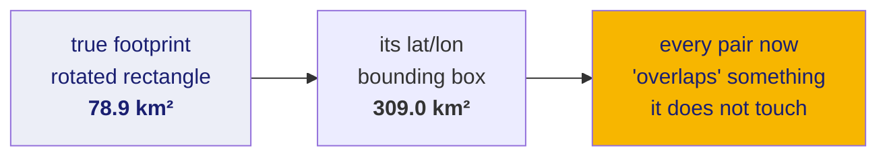
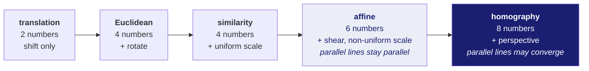

# 60 · Every piece of mathematics this project uses

Written for someone who can program but has not touched geometry since school.
Nothing here assumes you remember linear algebra notation — where a matrix
appears, what it *does* is spelled out first.

**New words in this doc**, defined again where they are used:

| word | plain meaning |
|---|---|
| **scalar** | a single number, like `3.7` |
| **vector** | a fixed-length list of numbers, like `[x, y]` — a point, or a direction |
| **matrix** | a grid of numbers used as a *function* that turns one vector into another |
| **radian** | an angle unit. 180° = π radians ≈ 3.14159. Every maths library uses radians; every data file uses degrees. Mixing them is the classic bug. |
| **residual** | how wrong a prediction was: `predicted − actual` |
| **norm** | the length of a vector. For `[a, b]` it is `sqrt(a² + b²)` — the Pythagoras distance. |

---

## Part 1 — Coordinates on a sphere

### 1.1 Latitude and longitude are angles, not distances

This is the single most important sentence in the document.

A **latitude** of −85° does not mean "85 units south". It means "rotate 85
degrees down from the equator". A **longitude** of 142° means "rotate 142
degrees around the axis".

Why that breaks ordinary programming instincts: if you treat `(lon, lat)` as
`(x, y)` and compute `sqrt(dx² + dy²)`, you get a number, it has no error, and
it is **wrong**, by an amount that depends on where you are.

The reason is that lines of longitude converge at the poles. One degree of
latitude is always the same ground distance. One degree of longitude is that
same distance **multiplied by cos(latitude)**:

```
ground distance of 1° of latitude   =  R · (π/180)                 ≈ 30.3 km on the Moon
ground distance of 1° of longitude  =  R · (π/180) · cos(latitude)
```

where `R` is the Moon's radius. This project uses:

```python
LUNAR_RADIUS_M = 1_737_400     # metres, defined in constants.py
```

Plug in the latitude of our real data:

| latitude | cos(lat) | 1° of longitude on the ground |
|---|---|---|
| 0° (equator) | 1.000 | 30.3 km |
| 60° | 0.500 | 15.2 km |
| **−85° (our OHRC data)** | **0.087** | **2.6 km** |
| 89.9° | 0.0017 | 53 m |

At our data's latitude, a degree of longitude is **eleven times shorter** than a
degree of latitude. Any code that treats them as interchangeable units is
producing garbage. This is the root cause of the polar handling in
`ingest/overlap.py`.

### 1.2 Turning an angle pair into a 3D point

To do anything geometric you convert `(longitude, latitude)` into a real 3D
position on the sphere. Standard spherical-to-Cartesian conversion:

```
x = R · cos(lat) · cos(lon)
y = R · cos(lat) · sin(lon)
z = R · sin(lat)
```

`lat` and `lon` in **radians**. Once you are in `(x, y, z)`, ordinary Euclidean
geometry works again — the sphere problem has been converted into a 3D problem.

### 1.3 Great-circle distance

The shortest path between two points on a sphere is along a **great circle** —
the circle you get by slicing the sphere through its centre and both points.
(On a globe, the equator is a great circle; a line of latitude other than the
equator is *not*.)

The stable formula is the **haversine**. It is stable in the sense that it does
not lose precision for two points that are very close together, which the
"obvious" formula using `arccos` does:

```
a = sin²(Δlat / 2) + cos(lat₁) · cos(lat₂) · sin²(Δlon / 2)
c = 2 · arcsin(sqrt(a))
d = R · c
```

`Δlat` = `lat₂ − lat₁`. Result `d` is in metres if `R` is.

### 1.4 Area of a polygon on a sphere

Four corner points define a quadrilateral **footprint** — the patch of ground an
image covers. Its area is not `width × height`, because the edges are curved.

For a spherical polygon, area comes from **spherical excess**: the interior
angles of a triangle drawn on a sphere add up to *more* than 180°, and the
excess is proportional to the area.

```
Area = R² · (sum of interior angles − (n − 2)·π)
```

for an `n`-sided polygon. `ingest/overlap.py` uses this against
`LUNAR_RADIUS_M`.

**Measured, and this is a real finding:** replacing the four true corners with
their latitude/longitude **bounding box** — the smallest north-south/east-west
rectangle containing them — inflates the area by **3.9× to 4.2×** on real OHRC
strips (78.9 km² becomes 309.0 km²) and **2.2× to 2.3×** on real TMC-2 frames.
The reason is that these footprints are *rotated* rectangles: the spacecraft's
ground track is not aligned to north. A rotated rectangle's bounding box is
enormously larger than the rectangle.



### 1.5 Polygon intersection

To find how much two footprints share, you intersect two polygons. This project
uses the **Foster–Hormann–Popa** algorithm (`clipFHP4` in `pygeodesy`), chosen
over the more famous Sutherland–Hodgman because Sutherland–Hodgman requires the
clipping polygon to be **convex** (no dents) and silently produces wrong results
otherwise. A footprint distorted near a pole is not reliably convex.

### 1.6 Projecting the polar case onto a flat plane

Near a pole the longitude coordinate becomes almost meaningless (see 1.1), so
before clipping, polar footprints are moved onto a flat plane using an
**azimuthal equidistant projection**. "Azimuthal" = built around a single centre
point; "equidistant" = distances measured *from that centre point* are preserved
exactly.

Implemented as `PolarFrame` in `ingest/overlap.py`, with:

```python
POLAR_CLIP_MAX_COLATITUDE_DEG = 60.0
```

**Colatitude** = 90° − latitude, i.e. angular distance from the pole. The limit
says: this projection is only trusted within 60° of its centre. Beyond that the
distortion grows and the code **refuses the pair rather than approximating it**.

**Measured:** switching between the flat-plane and spherical paths at the 80°
boundary produces a **0.3–0.8% discontinuity** in reported area. That is the
honest size of the seam between two methods, not a bug.

---

## Part 2 — Transforms between two images

### 2.1 What a transform is

A **transform** answers: "the thing at pixel `(x, y)` in image A — where is it
in image B?" It is a function from a 2D point to a 2D point.

They form a ladder, from least to most flexible:



The number under each is its **degrees of freedom** — how many independent
numbers you must solve for, and therefore the minimum number of matched point
pairs you need. Each matched pair gives you two equations (one for `x`, one for
`y`), so affine needs 3 pairs and homography needs 4.

### 2.2 Affine, written out

```
x' = a·x + b·y + c
y' = d·x + e·y + f
```

Six unknowns `a…f`. Written as a matrix — the matrix is just a compact way of
storing those six numbers so a library can apply them:

```
[x']   [a  b  c]   [x]
[y'] = [d  e  f] · [y]
[1 ]   [0  0  1]   [1]
```

The extra `1` is a bookkeeping trick (**homogeneous coordinates**) that lets the
`+c` and `+f` shift be expressed as multiplication, so the whole thing composes
by matrix multiplication.

### 2.3 Homography, and the divide that makes it different

```
      a·x + b·y + c                d·x + e·y + f
x' = ----------------      y' = ----------------
      g·x + h·y + 1                g·x + h·y + 1
```

The bottom row `g, h` is the entire difference. When `g = h = 0` this collapses
back to affine. When they are nonzero, the denominator varies across the image —
that is **perspective**, the effect that makes railway tracks converge.

**Why this matters here, and this is the project's most important geometric
finding:** a homography is the correct model for a flat scene photographed by a
camera with *one* viewpoint. OHRC has no single viewpoint. It builds its image
one line at a time over ~16 seconds while the spacecraft moves (doc 13). So
fitting a homography to a four-corner footprint asks the maths to invent a
perspective effect that the physics never produced.

**Measured** (`ingest/geometry_grid.py`, reproduced independently from the raw
CSV with no project code): the four-corner homography disagrees with the
per-pixel geometry file ISRO ships by a **median of 2554.6 pixels**, which at
0.25 m/px is **639 metres on the ground**.

**Measured, and product-dependent — do not quote as a general rule:** the
difference between the affine and homography fits is **2.4×** on our OHRC strip
but roughly **20×** on our TMC-2 frame. Different footprint shapes, different
sensitivity.

### 2.4 Solving for the transform: least squares

Given `n` matched point pairs with `n` larger than the minimum, there is
generally no transform that fits all of them exactly. **Least squares** picks
the one that minimises the sum of squared residuals:

```
minimise   Σ  ‖ T(pᵢ) − qᵢ ‖²
           i
```

Read that as: for every source point `pᵢ`, apply the transform, measure the
distance to where it should have landed (`qᵢ`), square it, add them all up, and
choose the transform that makes that total smallest.

Squaring is what makes this solvable in closed form (one linear algebra step, no
iteration). It is also its weakness: a single point that is wrong by 500 pixels
contributes 250,000 to the sum and drags the whole fit toward itself. Hence
Part 3.

---

## Part 3 — Fitting when some of the data is wrong

### 3.1 The problem

Feature matching produces **outliers** — pairs the matcher confidently declared
correspond, which do not. On lunar terrain outliers are not rare noise: craters
genuinely look like other craters, so a wrong match can be visually excellent.

### 3.2 RANSAC

**RANSAC** = RANdom SAmple Consensus. The idea is a guess-and-check loop that
gives up on using all the data:

```
best = none
repeat N times:
    pick the minimum number of pairs at random     (4 for a homography)
    fit a transform to exactly those
    count how many of ALL pairs this transform explains within a tolerance
        -> these are the "inliers"
    if that count beats the best so far, keep it
finally: refit by least squares using only the winning inlier set
```

Two parameters you must choose:

- **Inlier threshold** (in pixels). How close is "explained". Too tight and a
  correct transform is rejected; too loose and outliers are absorbed.
- **N**, the number of iterations. This has a formula rather than a guess:

```
N = log(1 − p) / log(1 − (1 − ε)^s)
```

`p` = probability you want of hitting at least one all-inlier sample (say 0.99),
`ε` = the fraction of your matches that are outliers, `s` = sample size (4).
At 50% outliers with `s = 4`, this gives N ≈ 72. At 80% outliers, N ≈ 4,715.
The growth is why a matcher that returns fewer but cleaner matches beats one
that returns many dirty ones.

### 3.3 ECC — sub-pixel refinement

RANSAC + least squares gets you close. To go **sub-pixel** — accurate to less
than the width of one pixel — the project uses **ECC**, Enhanced Correlation
Coefficient.

Unlike everything above, ECC ignores matched points entirely and works on raw
brightness. It searches for the transform that maximises the correlation between
the two images' pixel values, where the correlation is defined to be immune to
any *linear* brightness change (`new = α·old + β`):

```
                    Σ (aᵢ − ā)(bᵢ − b̄)
ECC(a, b)  =  ------------------------------
              sqrt( Σ(aᵢ − ā)² · Σ(bᵢ − b̄)² )
```

This is exactly the Pearson correlation coefficient, ranging −1 to +1. Because
the means are subtracted and the whole thing is divided by the magnitudes, it is
unchanged if you brighten or contrast-stretch either image.

**The catch, and it is documented in the code as a known defect:** lunar
illumination change is *not* linear (doc 01 — the lit wall becomes the dark
wall). ECC's invariance does not cover it. `align/refine.py` therefore has a
prefilter step and a selection heuristic:

```python
ECC_SAME_ILLUMINATION_NCC = 0.97
```

**Measured, and negative:** that heuristic tries to detect "same illumination"
from a correlation score, and it cannot — it confuses sensor noise with
illumination change. On a deliberately noisy test pair it scored 0.917 and
chose wrongly. It ships **disabled**, and is documented as defective rather than
tuned until the test passed.

---

## Part 4 — The metrics, and why the obvious one lies

### 4.1 RMSE

**Root Mean Square Error**, the metric the problem statement asks for:

```
RMSE = sqrt( (1/n) · Σ ‖ T(pᵢ) − qᵢ ‖² )
```

Take every matched pair, measure how far the transform misses, square, average,
square-root. Units: pixels.

### 4.2 Why it is not accuracy

RMSE here is computed **on the same points that were used to fit the
transform**. In machine-learning terms it is *training error*, and reporting it
as accuracy is the same mistake as reporting training accuracy as model
accuracy.

Two specific failures:

1. **It is minimised by construction.** Least squares chose the transform that
   makes this exact number small. Of course it is small.
2. **It is blind to where the points are.** Every match could sit in one corner
   of the image. RMSE would be excellent, and the transform would be wildly
   wrong everywhere else — which is precisely the "uniform distribution across
   the image" that ISRO's problem statement demands and RMSE cannot measure.

### 4.3 Measuring *where* the points are

Two independent uniformity measures, because either alone is gameable.

**Coverage entropy.** Divide the image into a grid of `k` cells, count matches
per cell, turn the counts into a probability distribution `pᵢ`, and compute
Shannon entropy:

```
H = − Σ pᵢ · log(pᵢ)            normalised:  H / log(k)  ∈ [0, 1]
```

1.0 means every cell holds an equal share. 0 means everything is in one cell.
It notices empty regions but not clumping *within* a cell.

**Clark–Evans index.** For each match, find the distance to its nearest
neighbouring match. Average those. Divide by what that average would be if the
points were scattered completely at random over the same area:

```
                mean nearest-neighbour distance          1
R  =  ---------------------------------------      E = ---------
                        E                              2·sqrt(ρ)
```

`ρ` = points per unit area. Then:

| R | meaning |
|---|---|
| ≈ 1.0 | randomly scattered |
| < 1.0 | **clustered** — points huddle together |
| > 1.0 | **regularly spread** — better than random, which is what we want |

It notices clumping at any scale, but is blind to a large empty region if the
occupied part is evenly filled. Hence both.

### 4.4 Bootstrap conditioning — how much to trust the fit

This is the project's least conventional metric and the one most worth
defending in a presentation.

The question it answers: *how much does the fitted transform depend on the
particular matches we happened to get?* A transform that changes drastically
when you resample its input is untrustworthy, no matter how good its RMSE.

**Bootstrapping** is a statistics technique: resample your data *with
replacement* to build many synthetic datasets of the same size, redo the whole
analysis on each, and look at the spread of answers.

```
for b in 1..B:                          # DEFAULT_N_BOOTSTRAP = 40
    sample n matches, with replacement, from the n matches you have
    refit the transform on that sample
    apply it to a fixed set of probe points
spread = standard deviation of where each probe point landed, across the B fits
```

`eval/conditioning.py` runs this and applies:

```python
EXTRAPOLATION_GATE_PX = 1.0
```

Regions where the bootstrap spread exceeds 1 pixel are marked as places the
transform is **extrapolating** rather than interpolating. This produces a *map*
of where the answer is trustworthy, not a single number — which is a strictly
stronger statement than any scalar metric, and directly addresses the
"across the image" half of the problem statement.

---

## Part 5 — The memory model for GPU tiling

Included here because it is genuinely a piece of algebra, and because it is the
constraint that shapes the system design in doc 70.

**LoFTR** (the learned matcher, doc 21) compares every location in image A
against every location in image B. If a tile is `S` pixels on a side, the
network first reduces it by a factor of 8, giving `(S/8)²` locations. The
comparison table is therefore `(S/8)² × (S/8)²` entries — it grows as
**S to the fourth power**.

Total memory, as modelled in `device.py`:

```
bytes(S) = BACKBONE_BYTES_PER_PX · S²  +  bytes_per_element · (S/8)⁴
           └── the CNN feature maps ──┘   └── the comparison table ──┘
```

```python
BACKBONE_BYTES_PER_PX = 3203.0      # MEASURED
FP16_BACKBONE_FACTOR  = 0.6         # ESTIMATED, NOT MEASURED
MAX_DENSE_TILE_PX     = 1408
```

To answer "what is the biggest tile that fits in `B` bytes", substitute
`u = S²` and the equation becomes an ordinary quadratic in `u`:

```
(bytes_per_element / 4096) · u²  +  BACKBONE_BYTES_PER_PX · u  −  B  =  0
```

Solve with the quadratic formula, take the positive root, `S = sqrt(u)`, round
down to a multiple of 64. That is `plan_dense_tile()`.

**Measured, with an important caveat.** The exponent was fitted from real runs:
**2.13 overall**, but the *local* exponent between adjacent tile sizes climbs
from **1.83 to 3.69**. That climb is the signature of the `S⁴` term taking over
from the `S²` term — small tiles are dominated by the CNN, large tiles by the
comparison table. **These figures come from host RAM on a machine with no
working GPU**, not from a CUDA device, and `match/memory.py` prints
"VRAM CANNOT BE MEASURED ON THIS MACHINE" rather than presenting them as VRAM.
They must be re-measured on the RTX 4060 before any of them is quoted as a
headroom figure.

---

## Where each piece lives in the code

| maths | module |
|---|---|
| spherical coordinates, great-circle distance | `ingest/overlap.py`, `constants.py` |
| spherical polygon area, polygon clipping | `ingest/overlap.py` |
| azimuthal equidistant projection | `ingest/overlap.py` (`PolarFrame`) |
| per-pixel geometry lookup, Newton inverse | `ingest/geometry_grid.py` |
| affine / homography estimation | `align/` |
| RANSAC | `align/` (OpenCV backend) |
| ECC refinement | `align/refine.py` |
| RMSE, entropy, Clark–Evans | `eval/` |
| bootstrap conditioning | `eval/conditioning.py` |
| error attribution | `eval/error_budget.py` |
| memory model and tile planning | `device.py` |
| memory measurement | `match/memory.py`, `match/benchmark.py` |
