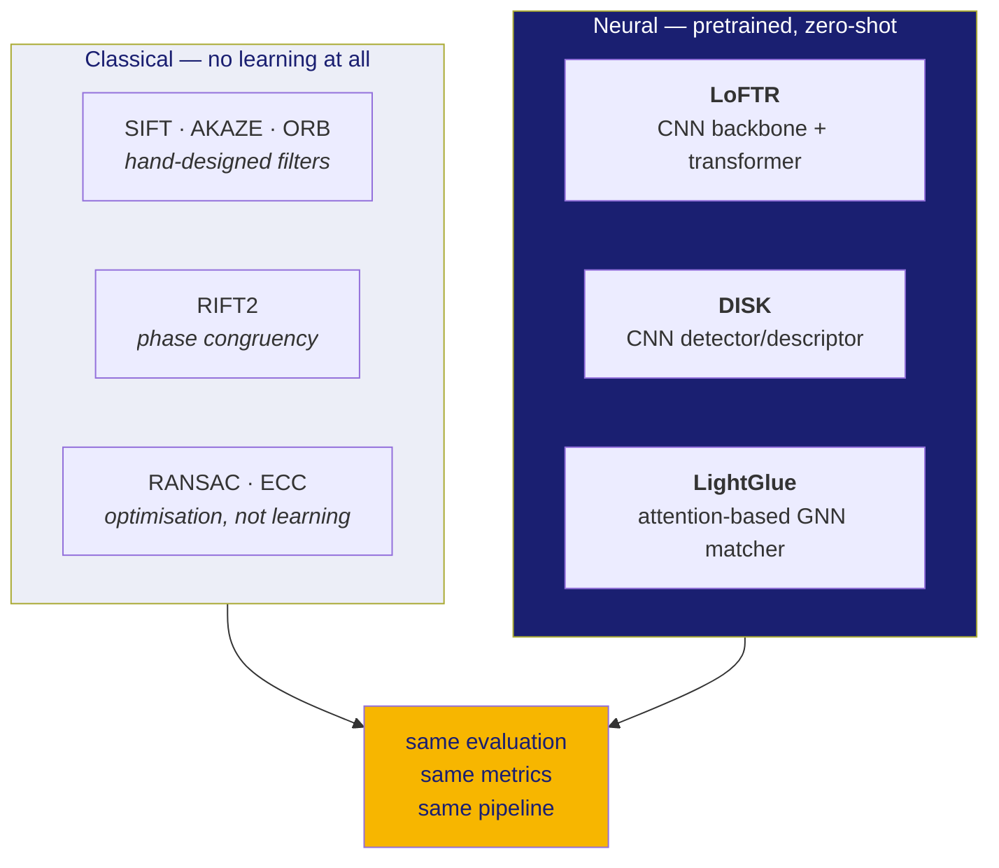

# 61 · Is there machine learning in this? Where could more of it go?

A direct answer to a direct question, in three parts: what is already here, what
is deliberately *not* here, and what could be added that would genuinely improve
the result rather than decorate it.

**New words in this doc:**

| word | plain meaning |
|---|---|
| **CNN** | Convolutional Neural Network. A network that slides small learned filters over an image. Good at "what does this patch look like". |
| **transformer / attention** | A network where every element can look at every other element and decide which ones matter. Good at "which patch over *there* corresponds to this patch over *here*". |
| **GNN** | Graph Neural Network. A network over a set of things and the connections between them, rather than over a grid. |
| **pretrained / zero-shot** | Using weights someone else trained, with no training run of our own. |
| **fine-tuning** | Taking pretrained weights and continuing to train them a little on your own data. |
| **LLM** | Large Language Model. A model over text. |
| **ground truth** | The known-correct answer, used to train or to score. |

---

## Part 1 — Yes. There is a lot of it already.

The project runs two families side by side: classical computer vision from the
1990s–2010s, and modern neural matchers. Both are first-class; the comparison
between them is part of the deliverable.

### What each neural component actually is

**LoFTR** (`match/learned.py`, `match/loftr.py`) — the main learned matcher.
Two stages, and both are neural. **Documented**, from the LoFTR paper:

1. A **CNN backbone** (a ResNet-style feature pyramid) turns each image into a
   grid of feature vectors at 1/8 resolution and another at 1/2 resolution.
2. A **transformer** applies self-attention (each location in image A attends to
   other locations in image A, giving it context about its surroundings) and
   cross-attention (each location in A attends to every location in B). The
   output is a full comparison table between the two images, and matches are
   read off its peaks. A second, smaller stage refines each match to sub-pixel
   position.

The word **detector-free** describes it: it never decides "this is a corner,
this is a keypoint". It compares everything to everything. That is why it works
on smooth lunar mare terrain where corner detectors find nothing, and it is also
why it is expensive — the comparison table is the `S⁴` term in doc 60, Part 5.

**DISK** (`match/learned.py`) — a CNN that finds keypoints and describes them.
Same job as SIFT, learned rather than hand-designed.

**LightGlue** — takes two sets of DISK keypoints and decides which pair with
which. It is an **attention-based graph neural network**: it treats the
keypoints as nodes, lets them exchange information, and learns to reason about
matches jointly rather than one at a time ("if these four already match, this
fifth one probably does too").

**SuperPoint + SuperGlue** (`match/superglue.py`) — the strongest performer in
the benchmark paper we compare against, and both are neural. It sits behind an
explicit acknowledgement gate in this project because its licence is
**"academic or non-profit, noncommercial research use only"**, with a clause
assigning ownership of derivatives to the licensor. It can be run for
comparison; it cannot ship in a submission.

### The classical side is not a legacy fallback

SIFT, AKAZE, ORB and RIFT2 are baselines on purpose. The comparison is the
scientific content: doc 01 shows SIFT collapsing from 228 matches to **0** as
the sun moves 60°, and that measured collapse is the argument for the neural
matchers. Without the baseline the argument is an assertion.

RIFT2 is a **clean-room implementation** in `match/rift2/` — written from the
paper rather than ported, because every existing implementation is unlicensed
(no licence means all rights reserved by default, which is worse than a
restrictive licence, not better).

---

## Part 2 — What is deliberately absent

### No training run. Anywhere.

Every neural weight in this project was trained by someone else, on terrestrial
imagery, and is used **zero-shot** — loaded and run, never updated. There is no
training loop, no optimiser, no dataset class, no checkpoint directory.

This is a deliberate design decision with a stated reason: it is what makes "a
working proof of concept in days on a single RTX 4060" true. It is also the
honest position — we have no lunar training set, and see Part 3 for why that is
harder than it sounds.

### No LLM. None. Not anywhere.

There is no language model in this project and no place where one would help
with the actual problem. Registering two images is a geometry problem; text is
not involved at any stage. Anyone claiming an LLM in an image-registration
pipeline is either describing a chat interface bolted on the side, or using
"LLM" loosely to mean "transformer" — and LoFTR *is* a transformer, but a
transformer over image patches, not over words.

If you want to say something true and impressive in a presentation, say:
*"the matcher is a transformer — the same attention mechanism as a language
model, applied to image patches instead of tokens, deciding which patch in one
image corresponds to which patch in the other."* That is accurate and it lands.

---

## Part 3 — The cherry on top: what could be added, ranked by honesty

Everything in this section is a **proposal**, not a result. None of it has been
implemented or measured. They are ordered by *how confident I am that it would
actually work*, which is not the same as how impressive it sounds.

### The blocker that shapes all of them

To fine-tune anything, you need ground truth: pairs of images plus the known
correct correspondence between them. For OHRC↔IIRS, **no such dataset exists**
publicly. `ingest/pseudo_gt.py` was written to manufacture a weak substitute
from independently-georeferenced overlap, and it reports its own confidence
honestly:

> **Measured floor: 23.09 m.** At OHRC's 0.25 m/px that is about **92 pixels**.

For a problem whose requirement is *sub-pixel*, 92-pixel supervision is not
usable for the fine stage. It is arguably usable for the **coarse** stage, which
only needs to get within a patch. That distinction decides which proposals below
are viable.

### Tier 1 — I would actually do this

**A. Train an illumination-normalising front-end on synthetic scenes.**

The strongest idea, for one reason: **we already have exact ground truth for it.**
`eval/scenes.py` generates synthetic lunar terrain with a controlled sun
position, so it can emit the *same terrain* under two illuminations with the
transform between them known perfectly. That is a supervised training set we
own, generate for free, and can make arbitrarily large.

Train a small CNN — an encoder-decoder of maybe 200k parameters — to map an
image to a representation in which the *same terrain under different sun angles
produces the same output*. Loss: the difference between the two encoded views of
identical terrain, plus a term preventing collapse to a constant.

Why this is the right cherry:
- It attacks the problem statement's headline challenge (illumination) directly.
- It trains in minutes on a 4060 at small resolution.
- It **replaces something that is currently broken**: `align/refine.py`'s
  illumination heuristic is documented as defective and ships disabled.
- It is measurable against the existing baseline: doc 01's 228 → 4 → 0 table is
  the "before". A learned front-end that keeps matches alive at 60° is a result
  with a number, not a claim.
- The synthetic-to-real gap is a real risk and must be stated as one. A number
  that only holds on synthetic scenes is a synthetic number.

**B. Fine-tune LoFTR's coarse stage on pseudo-ground-truth.**

92-pixel supervision is too coarse for the fine stage but roughly matches the
coarse stage's 1/8-resolution grid. Freeze the CNN backbone and the fine module,
train only the coarse attention layers, using LoRA-style low-rank adapters to
keep the memory footprint inside 8 GB.

Honest framing: this teaches the matcher *lunar appearance statistics*, not
lunar geometry. Expect it to reduce spurious matches on repetitive crater
fields. Do not expect it to improve sub-pixel accuracy — the supervision cannot
carry that information.

### Tier 2 — plausible, more work, less certain

**C. A learned per-match confidence gate.**

Train a small model (gradient boosting or a two-layer network — this does not
need to be deep) that predicts, for each proposed match, whether RANSAC will
call it an inlier. Features: matcher score, local texture energy, distance to
the nearest other match, local sun-angle difference.

Value: doc 60 Part 3.2 shows RANSAC's iteration count exploding with the outlier
rate — 72 iterations at 50% outliers, 4,715 at 80%. Cutting the outlier rate
before RANSAC is worth more than tuning RANSAC. Training labels come free from
existing runs: every RANSAC result already labels its own inputs.

**D. A learned cross-modal embedding for IIRS.**

The design already written up in `docs/CROSS_MODAL_IIRS.md`. A small encoder per
modality projecting a panchromatic patch and an IIRS spectral patch into a
shared space where matching patches are close. This is the technically
interesting problem and the one closest to unsolved research.

Flag it as such. It needs the pseudo-GT to be good enough, and at 23.09 m it
currently is not. Presenting this as *"here is the open problem, here is the
architecture we designed for it, here is the measurement that says our ground
truth is not yet good enough to train it"* is a stronger position in front of a
panel than presenting an untrained architecture as a contribution.

### Tier 3 — do not do these

**E. An LLM that writes the report.** It adds nothing to the problem, and a
panel that notices will read it as padding.

**F. A chat interface over the results.** Same, plus it invites questions about
hallucination that have nothing to do with your actual work.

**G. Training a matcher from scratch.** No dataset, no compute, no chance.

---

## If someone on the panel asks "where is the AI?"

The answer, in order:

1. The primary matcher is a **transformer** — self- and cross-attention over
   image features, the same mechanism as a language model, applied to pixels.
2. It is used **zero-shot**: pretrained weights, no training, which is a
   deliberate choice for reproducibility on one consumer GPU and is stated as
   such.
3. It is benchmarked against **classical baselines in the same harness**, and
   the measured collapse of the classical methods under illumination change is
   the evidence for the neural approach — not an assumption.
4. The place learning would help most is **illumination normalisation**, we have
   the synthetic ground truth to train it, and it is scoped in Tier 1A above.
5. The genuinely open problem is **cross-modal IIRS matching**, and the honest
   blocker is ground-truth quality, measured at a 23.09 m floor.

Every one of those five sentences is either measured or clearly labelled as a
proposal. That is a better answer than a longer list would be.
