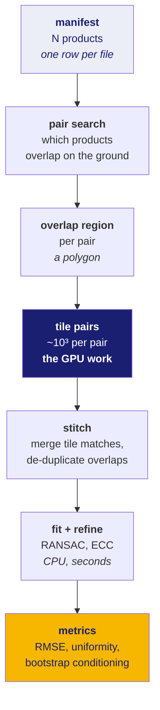
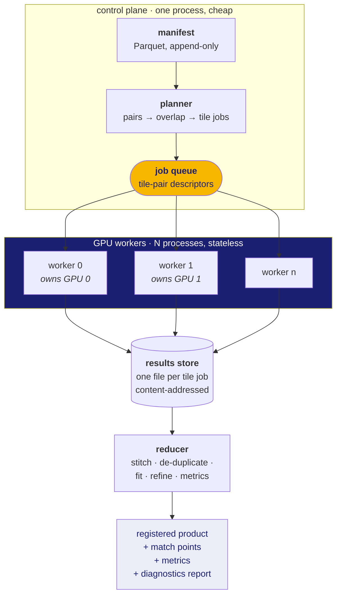

# 70 · System design — running this on many GPUs

**Status: this is a design, not a description.** Nothing in this document has
been built. The current pipeline runs in one process on one machine, and no run
on a GPU of any kind has happened yet. Every number below is either measured
from the single-machine code (and labelled) or an explicit unknown. There are no
throughput figures here because none have been produced.

Written for a software engineer. It assumes you know what a queue and a worker
are; it does not assume you know anything about the imagery.

**New words in this doc:**

| word | plain meaning |
|---|---|
| **strip / product** | one image file as delivered by the archive. An OHRC strip is a 1.2 GB ribbon of ground, 3 km × 25 km. |
| **tile** | a small square cut out of a strip — typically 512 to 1408 pixels a side — because the matcher cannot process a whole strip at once. |
| **pair** | two products that overlap on the ground and therefore might be registered to each other. |
| **VRAM** | memory on the graphics card. Separate from system RAM, much smaller, and the binding constraint here. |
| **embarrassingly parallel** | a workload that splits into pieces which need no communication with each other. The easy case. |
| **idempotent** | doing it twice has the same effect as doing it once. The property that makes retries safe. |

---

## Part 1 — What is actually being parallelised

Before designing anything, be precise about the shape of the work.

### The size of one unit

**Measured** from a real product label (`ingest/fieldmap.py`):

| | |
|---|---|
| one OHRC strip | 101,074 lines × 12,000 samples × 1 byte = **1,212,888,000 bytes** |
| ground footprint | ≈ 3 km × 25 km, **78.9 km²** |
| at a 1024 px tile with 128 px overlap | ≈ **1,300 tiles per strip** |

That last number is arithmetic on the two above, not a measurement of a run.

### The work breaks into a tree



**The tile-pair level is embarrassingly parallel.** Two tiles are matched against
each other with no reference to any other tile. That is the level to distribute,
and it is the only level that needs a GPU.

Everything above it is cheap and sequential-friendly. Everything below it is a
few seconds of CPU.

### Where the time is *not*

Be honest about this, because it changes the design:

- **Pair search is trivial.** Comparing every footprint against every other is
  O(N²) polygon intersections. At the scale of an archive query — hundreds to
  low thousands of products — that is seconds on one core. Do not build a
  distributed system for it.
- **Fitting is trivial.** RANSAC on a few thousand matches is milliseconds.
- **Reading is not trivial and is not GPU work.** Pulling a 128 KB tile out of a
  1.2 GB file is an I/O operation, and doing it 1,300 times per strip from
  network storage will dominate everything if you do it naively. See Part 4.

---

## Part 2 — The constraint that dictates the architecture

The unit of GPU work is not "a tile". It is **"a tile at a size that fits in
VRAM"**, and that size is small.

From `device.py` (doc 60, Part 5), memory for the dense matcher is:

```
bytes(S) = 3203 · S²  +  bytes_per_element · (S/8)⁴
```

The second term grows as the **fourth power** of the tile side. Double the tile
and you use sixteen times the memory for that term. Consequences:

```python
MAX_DENSE_TILE_PX = 1408      # a hard cap, not a tuning knob
```

**Measured** (host-RAM proxy, *not* VRAM — see the caveat below): the observed
memory exponent is **2.13 overall**, with the local exponent between adjacent
tile sizes climbing from **1.83 to 3.69**. That climb is the `S⁴` term taking
over. Below roughly 512 px you are paying for the CNN; above roughly 1024 px you
are paying for the comparison table, and the cost runs away.

> **The caveat, stated plainly.** These figures come from host RAM on the
> development machine, which has no working CUDA device — the nvidia kernel
> module is not loaded and the installed PyTorch is a CPU-only build.
> `match/memory.py` prints *"VRAM CANNOT BE MEASURED ON THIS MACHINE."* rather
> than presenting them as VRAM. The scaling shape is trustworthy; the absolute
> bytes are not. Every capacity number in this document inherits that caveat
> and must be re-measured on real hardware before anyone plans against it.

**What this means for the design:** a GPU worker's throughput is not "tiles per
second", it is "tiles per second *at a chosen tile size*", and the choice trades
against quality — smaller tiles mean more seams and more edge effects, which
`match/stitch.py` has to clean up. A scheduler that treats tiles as
interchangeable units of work is modelling the problem wrongly.

---

## Part 3 — The architecture

The honest recommendation: **a work queue with stateless GPU workers.** Not a
gradient-synchronised distributed training setup, because there is no training.
Not a parameter server. This is batch inference over independent items, which is
the simplest distributed pattern that exists, and the design should not be more
interesting than the problem.



### The job descriptor

A job must be **small, self-describing, and contain no image data**. Shipping
pixels through a queue is the classic mistake — it turns a 200-byte message into
a 1 MB one and makes the broker the bottleneck.

```jsonc
{
  "job_id": "sha256:…",             // content hash of this descriptor; the idempotency key
  "source":    { "uri": "s3://…/ohrc_strip.img",
                 "window": [12288, 4096, 1024, 1024] },   // row, col, h, w
  "reference": { "uri": "s3://…/lro_nac.img",
                 "window": [ 8192, 2048, 1024, 1024] },
  "matcher": "loftr/outdoor",
  "precision": "fp16",
  "tile_px": 1024,
  "est_vram_bytes": 4831838208,     // from device.dense_matcher_peak_bytes()
  "seed": 20260905                  // RANSAC/sampling determinism
}
```

The `est_vram_bytes` field is what makes scheduling possible: the planner knows
the cost of a job **before** dispatching it, because `device.py` models it in
closed form. That is unusual and worth exploiting — most batch systems have to
guess.

### Why stateless workers

A worker loads model weights once at startup and then loops: take a job, read
two windows, match, write a result, acknowledge. It holds no cross-job state.
Therefore:

- Any worker can take any job. No affinity, no sharding logic, no rebalancing.
- A worker that dies is replaced by starting another one. The job it was holding
  returns to the queue after its lease expires.
- Adding a machine is starting more workers. There is no cluster membership
  protocol to get wrong.

The one piece of per-worker state is the loaded model, which is why the worker
is long-lived rather than a process per job. Loading LoFTR weights per job would
dominate the runtime of the job itself.

### Scheduling: bin-packing, not round-robin

Because tile cost is known in advance and grows as `S⁴`, jobs are **not**
interchangeable. Two policies:

1. **Homogeneous-first.** Group jobs by tile size and drain one size at a time.
   The allocator on the GPU stays unfragmented, which matters — a card that has
   just processed a 1408 px tile may fail on the next 1408 px tile purely from
   fragmentation. `match/learned.py` already calls `torch.cuda.empty_cache()`
   after each dense pass for exactly this reason.
2. **Capacity-aware dispatch.** A worker advertises its free VRAM; the planner
   sends it the largest job that fits. This is what lets a mixed fleet work — an
   8 GB RTX 4060 and a 24 GB card should not be handed the same tile size.

### Handling heterogeneous GPUs

The tile size is a *per-worker* decision, derived at worker startup:

```python
plan = plan_dense_tile(device="cuda", precision="fp16", matcher="loftr/outdoor")
worker.max_tile_px = plan.tile_px      # 4060 and A100 arrive at different answers
```

The planner therefore emits jobs at a small set of allowed tile sizes (multiples
of 64, capped at `MAX_DENSE_TILE_PX`) rather than one global size, and workers
subscribe to the sizes they can serve.

---

## Part 4 — Data movement, which is where this design will actually fail

The failure mode to design against is not GPU contention. It is **1,300 workers
all doing random reads into the same 1.2 GB file over a network.**

### Windowed reads, never whole-file reads

`rasterio` (already a dependency, chosen for this reason) performs a **windowed
read**: it seeks to the byte range covering the requested rectangle and reads
only that. For an uncompressed band-sequential image the byte offset of a tile
is pure arithmetic — no index, no decode. A 1024×1024 single-byte tile is
1 MB read out of a 1.2 GB file.

The rule: **the job descriptor carries a window, never an array.**

### Locality: send the work to the data

Two products in a pair are typically on different storage. Options, in order of
preference:

1. **Node-local cache with consistent hashing.** Hash the product URI to a node;
   jobs touching that product prefer that node. First touch pulls the strip to
   local NVMe, everything after is a local read. With ~1,300 jobs per strip the
   cache hit rate approaches 1 after the first job.
2. **Pre-staging.** The planner knows the full job list before dispatch, so it
   knows exactly which products each node will need. Copy them before the run
   starts rather than faulting them in.
3. **Reading from object storage every time.** Simple, and acceptable at small
   scale, but it means ~1,300 HTTP range requests per strip per pair. Measure
   before assuming it is fine.

### What crosses the network per job

| direction | payload | rough size |
|---|---|---|
| planner → worker | job descriptor | ~300 bytes |
| storage → worker | two image windows | ~2 MB at 1024 px, 1 byte/px |
| worker → results | matched point pairs + scores | a few KB to ~1 MB |

The asymmetry is the point. Results are tiny; inputs are not. Optimise the input
path and ignore the output path.

---

## Part 5 — Failure handling

This project has a standing rule that batch code must never silently drop items
that fail. The distributed version has to preserve that, and distribution makes
it harder: a job can now fail in ways that are not about the data at all.

Every job ends in exactly one **classified outcome**, and the run prints the
counts for all of them plus one concrete sample per class — always, not only
when something went wrong:

| outcome | meaning | retry? |
|---|---|---|
| `OK` | matches produced | — |
| `NO_MATCHES` | ran fine, found nothing | no — this is a **result**, often correct for featureless mare |
| `DEGENERATE_OVERLAP` | the overlap polygon was empty or a sliver | no — data issue, surface it |
| `READ_FAILED` | window read errored | yes, bounded |
| `OOM` | GPU ran out of memory | yes, **at a smaller tile size** |
| `WORKER_LOST` | lease expired, no result | yes |
| `TIMEOUT` | exceeded wall-clock budget | yes once, then classify |

The critical distinction, and it is easy to lose in a distributed system:
`NO_MATCHES` and `WORKER_LOST` both produce zero matches, and they mean entirely
different things. Collapsing them into "failed" or, worse, into a silent absence
from the results, destroys the ability to tell a data problem from an
infrastructure problem. They must stay separate all the way through to the
printed report.

**`OOM` deserves its own note.** Because the memory model is closed-form, an OOM
is not a mystery — it means the model was wrong for this hardware. Retrying at a
smaller tile is the right immediate action, and the retry should be **recorded**,
because a run with many OOM-downgrades is telling you `BACKBONE_BYTES_PER_PX` or
`FP16_BACKBONE_FACTOR` needs re-measuring on this device. (`FP16_BACKBONE_FACTOR
= 0.6` is currently marked **ESTIMATED, NOT MEASURED** in the source.)

### At-least-once delivery, idempotent writes

Any queue that survives worker death delivers some jobs more than once. Make
that harmless: the result file is named by the job's content hash, so a
duplicate execution overwrites itself with identical content. No coordination
needed, no exactly-once machinery.

### Determinism

RANSAC samples randomly and the tile order is nondeterministic under a queue. To
keep a run reproducible:

- the seed lives **in the job descriptor**, derived from the job hash, so the
  same job always samples the same way regardless of which worker runs it;
- the reducer sorts matches by a stable key before fitting, so the final
  transform does not depend on the order results arrived in.

Without the second point, two runs over the same data produce transforms that
differ in the last decimal places, and you will lose an afternoon to it.

---

## Part 6 — What to actually build, and when

The design above scales to a cluster. Do not build it yet. Staged, cheapest
first:

### Stage 0 — where we are

One process, one machine, no GPU run yet. `pipeline.run_batch()` iterates pairs
sequentially with classified outcomes and a printed report.

### Stage 1 — one machine, one GPU *(the next real step)*

Not distribution at all: just get a CUDA run to happen. This unblocks
everything, because every capacity number in this document is currently a
host-RAM proxy. Concretely — re-run `match/benchmark.py` on the 4060 and replace
the estimated constants in `device.py` with measured ones.

### Stage 2 — one machine, N GPUs

`torch.multiprocessing`, one worker process pinned per GPU with
`CUDA_VISIBLE_DEVICES`, a `multiprocessing.Queue` of job descriptors, results
written to a local directory. **No broker, no cluster, no new dependency.**
This is perhaps 150 lines on top of the existing pipeline and captures most of
the available speedup for a hackathon-scale run.

### Stage 3 — many machines

Replace the in-process queue with a real broker and the local directory with
shared storage. The worker code is unchanged, because it was already stateless
and already took its input as a URI plus a window. Redis Streams or Ray both
work; Ray is fewer lines, Redis is fewer moving parts.

The reason Stage 2 is worth doing carefully is that it forces the job descriptor
to be a real, serialisable, self-contained thing. Once that boundary is right,
Stage 3 is a transport swap rather than a redesign.

### What to say about this in a presentation

That the workload is embarrassingly parallel at the tile level; that the per-job
GPU cost is known in closed form *before dispatch*, which is unusual and makes
scheduling a bin-packing problem rather than a guess; that the binding
constraint is a fourth-power memory term which caps tiles at 1408 px; and that
the honest current status is single-process with no GPU run yet, so the design
is a design.

That last clause is not a weakness to hide. A panel will trust the first three
claims more because the fourth one was volunteered.
